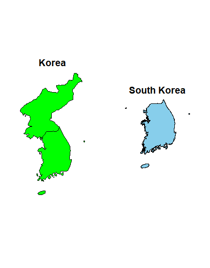
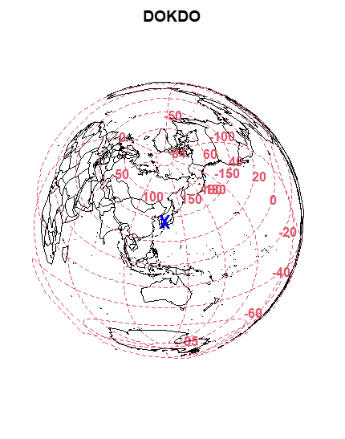
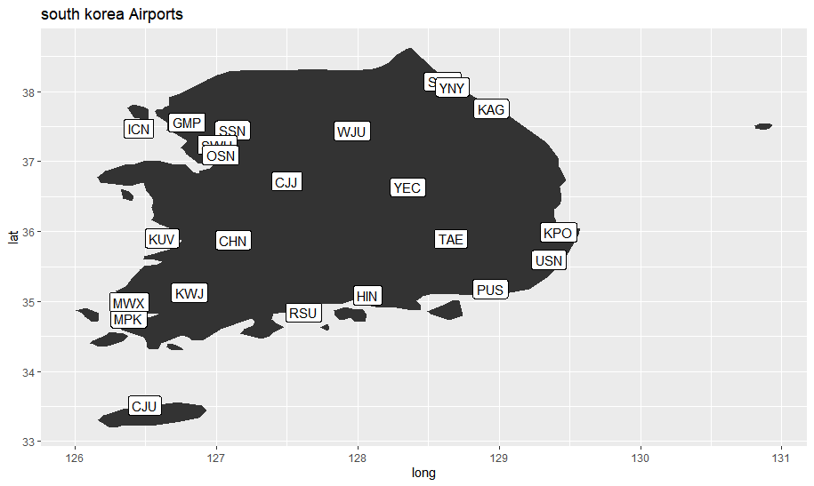

# R - InterMediate

> 그래픽을 포함한 R 중급이다. 
>
> 다양한 library를 사용해 본다.

## 1. 그래픽

### 1-1 R 그래픽

- R 기본 그래픽스 In base : 산점도, 상자그림, 등...
- Lattice : 직교형태의 멀티패널 툴(?)
- ggplot2 
  - gg : Grammar of Graphic 그래픽 생성시 각 요소를 구분
  - Incremental graphic : R base 그래픽보다 인터액티브한 그래프 가능, 기초 그림을 생ㅇ성 후 그래픽 요소를 필요에 따라 추가하거나 수정 한다.

### 1-2 Lattice

- xyplot, bwplot, contourplot, levelplot 등
  - xyplot : 산점도 - 조건부 변수를 통해 각 level별 그래프를 통해 3차원적 특성 확인 가능
  - bwplot : Box Whisker plot, 상자그림
  - stripplot : 점을 함께 표시한 상자그림
  - splom : 산점도 매트릭스
  - contourplot : 등고선 그림

- lattice 에 포함된 ethanol data를 이용한 실습

```R
# load data
ethanol <- read.csv("ethanol.csv")

# check data
head(ethanol)
dim(ethanol)
str(ethanol) # 관측치, 변수 개수, 변수 자료형, 변수들을 보여줌

# 조건부 변수로 C를 활용함, C 데이터의 빈도를 확인
table(ethanol$C)

# basic xyplot - 기본 산점도
xyplot(NOx ~ E, data = ethanol)
# y - NOx, x - E 를 통해 두 변수의 관계

# multi panel graph - 조건부 변수를 통해 확인
# 엔진압축비(C)가 조건부 변수로 활용
xyplot(Nox ~ E | C, data = ethanol)

# multi panel graph for subset 
# 조건부 변수를 필터링하여 멀티패널 그래프를 생성 가능
xyplot(Nox ~ E | C, data = ethanol, subset = C > 10)
# C > 10 인 데이터들에 한해 산점도 출력
```

### 1-3 ggplot2

- ggplot() 기본함수에 더해 추가적인 그래픽을 입힐 수 있다.
- Layers : aes(Aesthetic)
- Layer : geom(Geomatric objects)
- Layer : coor (coordinate system)

```R
# load & check data
car <- read.csv("car.csv")
head(car)
str(ca)

# 자동차 엔진에 따른 subset 생성
car1 <- subset(car, cyl ==4 | cyl == 6 | cyl ==8)
attach(car1)
# 엔진이 (4,6,8)인 자동차 데이터로만 구성

# 숫자형 변수를 범주형 변수로 변환
car$cyl <- as.factor(car1$cyl)
```

```R
# graph example1.
par(mfrow = c(1, 1))
ggplot(car1, aes(x=wt, y=disp, color=cyl, shape=cyl)) + geom_point(size=3, alpha=0.6)
```

1. 그래프 공간 생성 par()
2. ggplot( ) 
   1. car1 -> 데이터 입력
   2. aex -> 그리드 생성 
      - x-y 데이터 설정
      - 엔진에 따라 색상과 모양이 다름
3.  geom_point : 크기, 모양 설정 

```R
# graph example2.
p1 <- ggplot(car1, aes(factor(cyl), fill = factor(cyl)))
p1 <- p1 + geom_bar(width = .5)
p1 <- p1 + facet_grid(. ~ origin)

# samp option
ggplot(car1, aes(facotr(cyl), fill = factor(cyl))) + geom_bar(width = .5) + facet_grid(. ~ origin)
```

- 그래프를 하나씩 쌓아 올라가는게 가능함

1. ggplot() - 그래프 그리드 생성 ( 실질적 그래프 x )
   - aes( factor( cyl ) )  :  명목변수로 변환한 엔진에 맞춰 그리드를 생성한다. 
2. geom_bar() - 실질적 그래프 생성
   - width = .5 : 해당 크기의 굵기인 막대그래프 생성
3. facet_grid() -  새로운 조건부 변수 추가
   - . ~ origin : origin 변수를 조건부 변수로 추가, 각 origin별, 엔진 크기 별 데이터의 빈도를 확인 가능하다.

```R
# graph example3
par(family = '나눔고딕', cex= 1.3)
p <- ggplot(data = car1, aes(factor(cyl)))
p + geom_bar(aes(fill=factor(origin)), colour = 'black')
```

- 누적 막대 그래프

1. par() - 그래프 속성 정의
   - family : font 지정, 한글이 깨진다면 한글 폰트로 지정
2. ggplot() 그래프 생성
3. geom_bar() - 그리드 생성
   - aes( fill = facotr(origin)) : 엔진별로 명목형 origin에 따라누적 막대그래프가 생성된다.
   - colour = 'black' : color X colour O

```R
# graph example4
# scatter with regression line

ggplot(car1, aex(x = wt, y = mpg)) + geom_point(shape = 1) + geom_smooth(method = lm, colour = 'red', se = FALSE) + geom_smooth(method = 'loess')
```

- 산점도와 두개의 회귀선을 추가한 그래프

1. ggplot() 
2. geom_point - 산점도 점의 모양 선택
   - shape = 1 : 속이 빈 점 
3. geom_smooth
   - method : 회귀선의 종류 선택 
     - lm : Linear Regression
     - 'loess' : Polynomial Regression
   - colour : 색 선택 **Color X colour O**
   - se : 신뢰구간 표시 T/F 

### 1-4 3D 

- 3d plot -> `lib : scatterplot3d `
- trees data를 사용한 예제 실습

```R
# load & check data
data(trees)
help(trees)
head(trees)
```

- 변수 : grith: 지름	height : 키	volum : 부피  = > 지름과 키를 이용해 부피를 예측하는 실습 volum = f(grith, height)

```R
# 3d plot example
par(mfrow = c(1,1))
s3d <- scatterplot3d(trees, type = 'h', highlight.3d = TRUE, angle = 55, scale.y = 0.7, pch = 16 )

# add point
s3d$points3d(seq(10,20,2),seq(85,60,-5),seq(60,10,-1), col = 'blue', type = 'p', pch = 16)

# add regression plane
my.lm <- lm(Volume ~ Grith + Height)
s3d$plane3d(my.lm, lty.box = "solid")
```

- 3차원 산점도 모형에 차례로 점, 선형 면을 추가한 plot

1. scatterplot3d() - 3차원 산점도 모형 생성
   - trees - data 입력, 3개의 컬럼으로 3차원으로 표현
   - type - 점의 표현 
     - h : 수직선 	p : 점 	l : 점을 선으로 이음
   - highlight.3d - T/F 좌표(coor)에 따라 색이 다르게 표현
   - pch : 점의 모양 
     - 1 :  속이 빈 점	16 : 속이 찬 점 등...
2. s3d$points3d : 생성된 3d plot에 points3d(점)기능 추가
3. lm() : y_Volume = f( x1_Grith, x2_Height)
4. s3d$plane3d : 생성된 3d plot에 plane3d(회귀 면)기능 추가

###  1-5 Heatmap

- 변수와 변수의 상관관계를 확인할 수 있다.

```R
# heatmap basic
# using USArrests data

# correlation matrix
cor(USArrests)
# make matrix
x <- as.matrix(USArrests[ , -3 ])

result <- heatmap(x, scale = 'column' )

row.names(USArrests)[result$rowInd[1:10]]
row.names(USArrests)[result$rowInd[35:50]]
```

- 기본적인 heatmap 생성 방법

1. cor(USArrests) - 상관행렬을 보여준다
2. as.matrix - heatmap의 데이터는 matrix형태여야 한다. 이때, USArrests 의 3번째 데이터는 도시 인구 비율이므로 도시별 범죄양과 상관없으므로 삭제한다.
3. scale = 'column'  : column 방향으로 스케일링 한다.
4. row.names([~~]) : 상-하위 결과를 슬라이싱 한다.

### 1-6 공간지도분석

- 지도를 통해 데이터를 공간에 표현할 수 있다.

- 사용 library
  - ggplot2	dplyr	maps	mapdata	mapproj

```R
# Korea Map
par(mfrow = c(1,2), mar = c(2,2,2,2))
map(database = 'world', regoion = c('South Korea'), col = 'green',fill = TRUE)
title("Korea")

map(database = 'worldHires', region = c('South Korea'), col = 'sky blue', fill = TRUE)
title("South Korea")
```

- 한국 지도 예제

1. map() : 지도를 사용한다
   - database  = 'world' / 'wroldHires' - 세계지도 사용
   - region = 지역 필터링 : 각 나라별로 필터링 할 수 있다.
   - col , fill : 색을 선택해서 지도에 채울 수 있다. 




```R
# DOKDO on globe
par(mfrow = c(1,1), mar = c(2,2,2,2))
map('world', proj = 'azequalarea', orient = c(37.24223, 131.8643, 0))
map.grid(col = 2)
points(mapproject(list(y = 37.24223, x = 131.8643)), col = "blue", pch = "x" cex =2)
title("DOKDO")
```

- 지구본 모양에 독도를 표시한다

1. map() 지도를 생성한다
   - proj : 지구본 모양으로 생성
   - orient : 중심 - 독도의 좌표
2. map.grid() 격자를 생성
3. points() 지도에 마크를 표시한다.



```R
# Korea Airport with ggplot

# Map Filterling
world.map <- map_data('world')
kr.map <- world.map %>% filter(region == "south Korea")

# add plot
ggplot() + geom_polygon(data = kr.map , aes(x = long, y = lat, group = group)) + geom_label(data = airport, aes(x = lon, y = lat, label = iata)) + labs(title = "South Korea Airports")
```

- 한국지도에 한국 공항 표시하기

1. world.map - 세계 지도 생성
2. kr.map - 한국 지역을 필터링
3. ggplot() - plot 생성
4. geom_polygon() - 데이터를 통해 지도 생성
   - long , lat 에 맞춰 지도 생성 
5. geom_label () - 데이터에 레이블 생성 (공항)
6. labs() - 제목 생성




