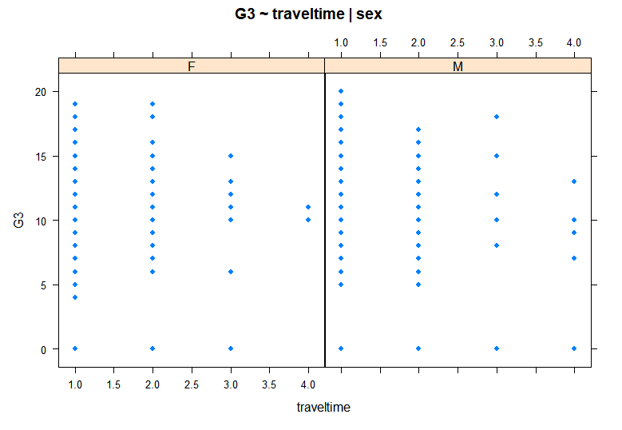

# R - InterMediate

> 그래픽을 포함한 R 중급이다. 
>
> 다양한 library를 사용해 본다.

## 1. 그래픽

### 1-1 R 그래픽

- R 기본 그래픽스 In base : 산점도, 상자그림, 등...
- Lattice : 직교형태의 멀티패널 툴(?)
- ggplot2 
  - gg : Grammar of Graphic 그래픽 생성시 각 요소를 구분
  - Incremental graphic : R base 그래픽보다 인터액티브한 그래프 가능, 기초 그림을 생ㅇ성 후 그래픽 요소를 필요에 따라 추가하거나 수정 한다.

### 1-2 Lattice

- xyplot, bwplot, contourplot, levelplot 등
  - xyplot : 산점도 - 조건부 변수를 통해 각 level별 그래프를 통해 3차원적 특성 확인 가능
  - bwplot : Box Whisker plot, 상자그림
  - stripplot : 점을 함께 표시한 상자그림
  - splom : 산점도 매트릭스
  - contourplot : 등고선 그림

- lattice 에 포함된 ethanol data를 이용한 실습

```R
# load data
ethanol <- read.csv("ethanol.csv")

# check data
head(ethanol)
dim(ethanol)
str(ethanol) # 관측치, 변수 개수, 변수 자료형, 변수들을 보여줌

# 조건부 변수로 C를 활용함, C 데이터의 빈도를 확인
table(ethanol$C)

# basic xyplot - 기본 산점도
xyplot(NOx ~ E, data = ethanol)
# y - NOx, x - E 를 통해 두 변수의 관계

# multi panel graph - 조건부 변수를 통해 확인
# 엔진압축비(C)가 조건부 변수로 활용
xyplot(Nox ~ E | C, data = ethanol)

# multi panel graph for subset 
# 조건부 변수를 필터링하여 멀티패널 그래프를 생성 가능
xyplot(Nox ~ E | C, data = ethanol, subset = C > 10)
# C > 10 인 데이터들에 한해 산점도 출력
```

### 1-3 ggplot2

- ggplot() 기본함수에 더해 추가적인 그래픽을 입힐 수 있다.
- Layers : aes(Aesthetic)
- Layer : geom(Geomatric objects)
- Layer : coor (coordinate system)

```R
# load & check data
car <- read.csv("car.csv")
head(car)
str(ca)

# 자동차 엔진에 따른 subset 생성
car1 <- subset(car, cyl ==4 | cyl == 6 | cyl ==8)
attach(car1)
# 엔진이 (4,6,8)인 자동차 데이터로만 구성

# 숫자형 변수를 범주형 변수로 변환
car$cyl <- as.factor(car1$cyl)
```

```R
# graph example1.
par(mfrow = c(1, 1))
ggplot(car1, aes(x=wt, y=disp, color=cyl, shape=cyl)) + geom_point(size=3, alpha=0.6)
```

1. 그래프 공간 생성 par()
2. ggplot( ) 
   1. car1 -> 데이터 입력
   2. aex -> 그리드 생성 
      - x-y 데이터 설정
      - 엔진에 따라 색상과 모양이 다름
3.  geom_point : 크기, 모양 설정 

```R
# graph example2.
p1 <- ggplot(car1, aes(factor(cyl), fill = factor(cyl)))
p1 <- p1 + geom_bar(width = .5)
p1 <- p1 + facet_grid(. ~ origin)

# samp option
ggplot(car1, aes(facotr(cyl), fill = factor(cyl))) + geom_bar(width = .5) + facet_grid(. ~ origin)
```

- 그래프를 하나씩 쌓아 올라가는게 가능함

1. ggplot() - 그래프 그리드 생성 ( 실질적 그래프 x )
   - aes( factor( cyl ) )  :  명목변수로 변환한 엔진에 맞춰 그리드를 생성한다. 
2. geom_bar() - 실질적 그래프 생성
   - width = .5 : 해당 크기의 굵기인 막대그래프 생성
3. facet_grid() -  새로운 조건부 변수 추가
   - . ~ origin : origin 변수를 조건부 변수로 추가, 각 origin별, 엔진 크기 별 데이터의 빈도를 확인 가능하다.

```R
# graph example3
par(family = '나눔고딕', cex= 1.3)
p <- ggplot(data = car1, aes(factor(cyl)))
p + geom_bar(aes(fill=factor(origin)), colour = 'black')
```

- 누적 막대 그래프

1. par() - 그래프 속성 정의
   - family : font 지정, 한글이 깨진다면 한글 폰트로 지정
2. ggplot() 그래프 생성
3. geom_bar() - 그리드 생성
   - aes( fill = facotr(origin)) : 엔진별로 명목형 origin에 따라누적 막대그래프가 생성된다.
   - colour = 'black' : color X colour O

```R
# graph example4
# scatter with regression line

ggplot(car1, aex(x = wt, y = mpg)) + geom_point(shape = 1) + geom_smooth(method = lm, colour = 'red', se = FALSE) + geom_smooth(method = 'loess')
```

- 산점도와 두개의 회귀선을 추가한 그래프

1. ggplot() 
2. geom_point - 산점도 점의 모양 선택
   - shape = 1 : 속이 빈 점 
3. geom_smooth
   - method : 회귀선의 종류 선택 
     - lm : Linear Regression
     - 'loess' : Polynomial Regression
   - colour : 색 선택 **Color X colour O**
   - se : 신뢰구간 표시 T/F 

### 1-4 3D 

- 3d plot -> `lib : scatterplot3d `
- trees data를 사용한 예제 실습

```R
# load & check data
data(trees)
help(trees)
head(trees)
```

- 변수 : grith: 지름	height : 키	volum : 부피  = > 지름과 키를 이용해 부피를 예측하는 실습 volum = f(grith, height)

```R
# 3d plot example
par(mfrow = c(1,1))
s3d <- scatterplot3d(trees, type = 'h', highlight.3d = TRUE, angle = 55, scale.y = 0.7, pch = 16 )

# add point
s3d$points3d(seq(10,20,2),seq(85,60,-5),seq(60,10,-1), col = 'blue', type = 'p', pch = 16)

# add regression plane
my.lm <- lm(Volume ~ Grith + Height)
s3d$plane3d(my.lm, lty.box = "solid")
```

- 3차원 산점도 모형에 차례로 점, 선형 면을 추가한 plot

1. scatterplot3d() - 3차원 산점도 모형 생성
   - trees - data 입력, 3개의 컬럼으로 3차원으로 표현
   - type - 점의 표현 
     - h : 수직선 	p : 점 	l : 점을 선으로 이음
   - highlight.3d - T/F 좌표(coor)에 따라 색이 다르게 표현
   - pch : 점의 모양 
     - 1 :  속이 빈 점	16 : 속이 찬 점 등...
2. s3d$points3d : 생성된 3d plot에 points3d(점)기능 추가
3. lm() : y_Volume = f( x1_Grith, x2_Height)
4. s3d$plane3d : 생성된 3d plot에 plane3d(회귀 면)기능 추가

###  1-5 Heatmap

- 변수와 변수의 상관관계를 확인할 수 있다.

```R
# heatmap basic
# using USArrests data

# correlation matrix
cor(USArrests)
# make matrix
x <- as.matrix(USArrests[ , -3 ])

result <- heatmap(x, scale = 'column' )

row.names(USArrests)[result$rowInd[1:10]]
row.names(USArrests)[result$rowInd[35:50]]
```

- 기본적인 heatmap 생성 방법

1. cor(USArrests) - 상관행렬을 보여준다
2. as.matrix - heatmap의 데이터는 matrix형태여야 한다. 이때, USArrests 의 3번째 데이터는 도시 인구 비율이므로 도시별 범죄양과 상관없으므로 삭제한다.
3. scale = 'column'  : column 방향으로 스케일링 한다.
4. row.names([~~]) : 상-하위 결과를 슬라이싱 한다.

### 1-6 공간지도분석

- 지도를 통해 데이터를 공간에 표현할 수 있다.

- 사용 library
  - ggplot2	dplyr	maps	mapdata	mapproj

```R
# Korea Map
par(mfrow = c(1,2), mar = c(2,2,2,2))
map(database = 'world', regoion = c('South Korea'), col = 'green',fill = TRUE)
title("Korea")

map(database = 'worldHires', region = c('South Korea'), col = 'sky blue', fill = TRUE)
title("South Korea")
```

- 한국 지도 예제

1. map() : 지도를 사용한다
   - database  = 'world' / 'wroldHires' - 세계지도 사용
   - region = 지역 필터링 : 각 나라별로 필터링 할 수 있다.
   - col , fill : 색을 선택해서 지도에 채울 수 있다. 


```R
# DOKDO on globe
par(mfrow = c(1,1), mar = c(2,2,2,2))
map('world', proj = 'azequalarea', orient = c(37.24223, 131.8643, 0))
map.grid(col = 2)
points(mapproject(list(y = 37.24223, x = 131.8643)), col = "blue", pch = "x" cex =2)
title("DOKDO")
```

- 지구본 모양에 독도를 표시한다

1. map() 지도를 생성한다
   - proj : 지구본 모양으로 생성
   - orient : 중심 - 독도의 좌표
2. map.grid() 격자를 생성
3. points() 지도에 마크를 표시한다.


```R
# Korea Airport with ggplot

# Map Filterling
world.map <- map_data('world')
kr.map <- world.map %>% filter(region == "south Korea")

# add plot
ggplot() + geom_polygon(data = kr.map , aes(x = long, y = lat, group = group)) + geom_label(data = airport, aes(x = lon, y = lat, label = iata)) + labs(title = "South Korea Airports")
```

- 한국지도에 한국 공항 표시하기

1. world.map - 세계 지도 생성
2. kr.map - 한국 지역을 필터링
3. ggplot() - plot 생성
4. geom_polygon() - 데이터를 통해 지도 생성
   - long , lat 에 맞춰 지도 생성 
5. geom_label () - 데이터에 레이블 생성 (공항)
6. labs() - 제목 생성


## 2. 데이터 탐색

### 2-1 Data Handling

```R
# data1, data2, data3 ...
# 1. merge

data121 <- merge(data1, data2, by = <col>)
data122 <- cbind(data1, data2)

# 2. Add row 
data123 <- rbind(data1, data2)
```

- 데이터 병합
  - cbind와 merge는 비슷하다.	 	
  - rbind 는 행을 늘려준다. 즉 데이터가 많아 진다.

```R
# data sorting
data1 <- data1[order(data1$col1,data1$col2, ...),]

# data subset
data2 <- subset(data1, data1$col1 cond &/| data$col2 cond)

# exclude var
data2 <- data1[!names(data) %in% c("col1","col2")]
```

- 정렬
  -  order( 기준 컬럼 ), 각 기준 컬럼별 정렬, 기본 - 오름
- subset
  - 데이터의 각 컬럼별 조건에 맞는 데이터를 추출
- exclude
  - 데이터에서 특정 컬럼을 제외하고 추출

### 2-2 기술통계치 요약

```R
# stringasfactors
data <- read.csv('file.csv',stringAsFactors = TRUE)

# basic function
summary(data)
mean(col1)
sqrt(var(col2))
sd(col3)

# selecting var
data[c('col1','col2','col3')]

# categorical data
table(data)
barplot(table(data))
```

- 다양한 기법
  - `stringAsFactors` : 인자를 `TRUE`로 설정하면 csv파일을 불러들이며 `string` 객체를 `Factor` 객체로 자동으로 전환
  - 변수 선택은 기본 슬라이싱 기법과 동일, R은 특히 벡터로 입력해야한다는 것을 잊지 말자
  - 범주형 변수의 경우 데이터의 빈도 확인을 위해 `table() `사용가능, barplot으로 시각적으로 나타낼 수 있다. `factor`객체로 정의 되어있는 경우 `summary()`를 통해 확인 가능하다

### 2-3 데이터 탐색 with Graph

- 그래프로 데이터를 시각화 하고 데이터가 줄 수 있는 의미를 파악한다.

```R
# data - Student math grade data
# target - math grade with school year

par(mfrow =c(2,2))
hist(g1, breaks = 10, col = 'lightblue')
hist(g2, breaks = 10, col = 'green')
hist(g3, breaks = 10, col = 'coral')
```


- 1학년은 전체적으로 균등하지만, 일정 하위수준에서 크게 변한다.
- 2학년은 중간층이 급증했다. 평균보다 낮은 점수의 학생이 줄은 반면, 중간점수 학생이 늘었다.
- 3학년은 0점인 학생이 가장 많다. 이상치인지는 확인이 필요하다. 이외에는 전체적으로 2학년과 비슷하다.

```R
# Exploratory Data wit boxplot
par(mfrow = c(1,2))
boxplot(g3 ~ address, boxwex = 0.5, col = c('yellow','coral'),main = 'g3 by (Urban, Rural)' )
boxplot(g3~traveltime, boxwex = 0.5 col = c('red','orange'))
```


- 3학년 성적을 확인했을때 전체적으로 시골지역보다 도시지역의 학생들의 성적이 약간 높은 것을 확인 할 수 있다.
- 통학시간에 따른 성적을 확인했을때, 통학시간이 길어질수록 눈에띄는 성적감소가 일어난다.

```R
# scatter with condition
xyplot(G3 ~ traveltime | sex, data = stud, pch = 16, main = 'g3 ~ traveltime | sex')
```




- `lattice` 의 `xyplot`을 활용하면 조건을 추가하여 두 변수간의 관계를 3차원처럼 확인할 수 있다.
- 남-여 모두 통학시간이 짧은 학생이 더욱 많았다.
- 통학시간이 긴 경우에 여학생보다 남학생이 비교적 성적이 높았다.

```R
# use ggplot check data

ggplot(data, aes(x = g1, y =g3, color = sex, shape = sex)) + geom_point(size = 2)
```


- `ggplot`을 사용하여 레이아웃을 쌓는 형식으로 그래프를 만들 수 있다.
- 여성과 남성에 크게 상관없이 1학년 성적이 높은 학생이 3학년 성적도 높다.
- 개인적 견해로는 남학생의 경우 성적 증가의 경우가 여학생보다 많고 여학생은 대체적으로 안정적 성적 양상을 보인다.

```R
ggplot(data, aes(romantic)) + geom_bar(aes(fill = sex), width = .4, colour = 'black') + ggtitle('Romantic by sex')
```


- 성별에 따른 연애 여부를 확인할 수 있다.
- 전체적으로 여학생 수가 많고, 성별에 따라 연애 경험에 차이가 어느정도 있다.

### 2-4 정규성 검정

- 정규성검정을 통해 해당 데이터의 분포가 정규분포를 따르는지 확인할 수 있다.
- `qqnorm` , `shapiro.test` , `ad.test`

```R
# Norm Q-Q plot
qqnorm(G1)
qqline(G1, col = 2, cex = 7)

# shapiro-Wilks test
shapiro.test(G3)

# Anderson-Darling test
library(nortest)
ad.test(G3)

# G2, G3 same
```


- `Q-Q plot` 으로 확인할 수 있다. `qqline`과 `qqnorm` (점)이 일정하게 일치해야 정규분포를 따르는 것으로 확인할 수 있다.
- 그림을 확인한 결과 3개 학년 모두 일정 부분에서 정규분포를 따르지 않는것을 확인할 수 있다.

- `Shapiro-Wilks` 혹은 `Anderson-Darling` 검증으로도 확인 가능 하다. 이때 귀무가설은 ''데이터가 정규분포를 따른다'이므로 `p-value`가 일정 수준이하라면 귀무가설을 기각하지 못한다.

### 2-5 RandomVariable

```R
# random variable from distribute
# add 'r' keyword in front of distribution
runif(n , min= , max = )
rnorm(n , mean=  , sd = )
rgamma(n , shape , rate )
rbinom(n ,  size , prob = )

```

- 특정 분포를 따르는 무작위수를 생성할 수 있다.
- 특정 분포 앞에 r 을 붙여서 생성할 수 있다.

## 3. 통계분석

### 3-1 t-test & Wilcoxon test

- 데이터를 확인할때는 검정통계량과 시각화 그래프를 함께 확인하여야 한다.

```R
# single t-test
t.test(x, mu = n)

# two sample t-test
t.test(y~ x, data = data1, alternative = c( " "))
```

- `t.test` 를 통해 t-test 수행 가능하다.
- `alternative`인자를 통해 one-side-test / two side test 를 설정할 수 있다. (`less`, `greater`, `two.sided` )

```R
# Wilcoxon test
wilcox.test(G3 ~ address)
```

- 비모수 검정방법 `Wilcox.test` 를 사용할 수 있다.
- 순위척도에 사용, `p-value` 를 반환한다.


### 3-2 Paired t-test

```R
# paired t-test
t.test(pre, post, mu = 0 , paired = T)
```

- 짝을 이룬 두 집단의 평균의 차이를 확인한다.
- `t-test`기법에서 `paired` 인자를 추가해준다.
- `paired t-test` 는 전에 [여기](https://xiang32.tistory.com/10)서 열심히 정리했다.

### 3-3 분산분석 ANOVA

- 전체 분산을 분할하여 어떤요인`factor`의 영향이 유의한지 검정할 수 있다.

```R
# ANOVA
a <- aov(target ~ reason)
summary(a)
tapply(target , reason, mean | sd | var)
```


- 앞서 2-3에서 그래프를 통해 확인한 데이터로는 연애여부는 성적에 유의미한 변화가 없다고 판단되었다.
- 하지만 anova검정을 통해 `p-value`를 확인한 결과 유의수준 0.01 하에서 유의한 결과가 나왔다.
- 따라서 그래프와 검정통계 두 방법 중 하나만 사용하는 것이 아닌 두 가지 모두를 사용해서 데이터를 탐색해야한다.

### 3-4 사후검정

- 사후검정은 ANOVA검정 후 유의하다고 판단된 요인이 있다면, 그 다음으로 하는 검정이다.

```R
# posthoc analysis
# using Tukey's Honest Significant Difference Test
TukeyHSD(anova_result, "Factor", ordered = T/F)
```

- 각 요소에 대해서 신뢰구간을 제시함으로서 해당 요인이 유의한지 확인할 수 있다.

### 3-5 이원분산분석 two-way ANOVA

- 앞서 수행한 분산분석을 두 개 이상의 factor를 이용해 수행한다.

```R
# two-way ANOVA
res1 <- aov(value ~ factor1 + factor2)
summary(res1)

# two-way ANOVA with interaction
res2 <- aov(value ~ factor1 + factor2 + factor1 *  factor2)
summary(res2)
```

- two-sample t-test 와 비슷하게 수행된다.
- 두 요인의 상호작용이 미치는 영향을 확인하기 위해서는 `*`로 두 요인을 묶어준다.
- 이 외에는 대체적으로 비슷하다.


- 실습 결과 `drug`요인은 유의한 영향이 있지만, `age`와 두 요인의 `상호작용`은 크게 유의한 영향은 없는 것으로 판단된다.


```R
interaction.plot(fac1, fac2, target)
```

- 하지만 그래프를 통해 확인한 결과 10mg `drug`의 투여에서 `age`에 따른 유의한 차이가 있는 것으로 확인된다.
- 따라서 그래프와 검정통계량 모두 확인해야한다.

