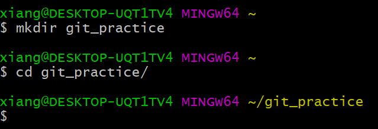
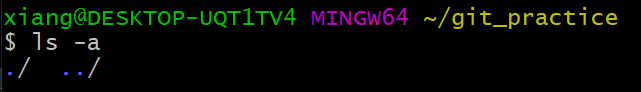
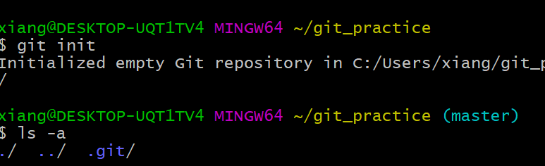
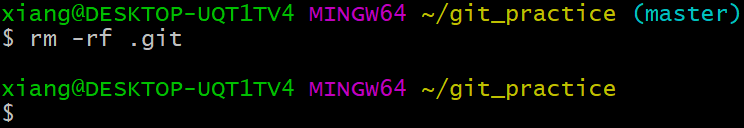
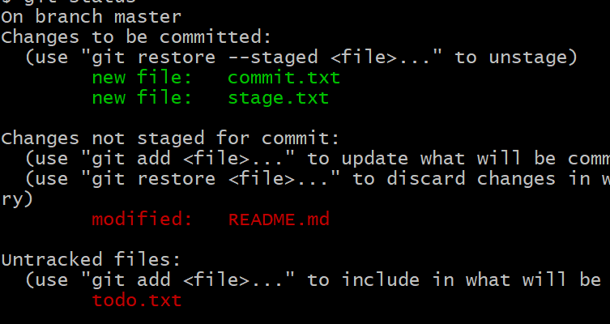
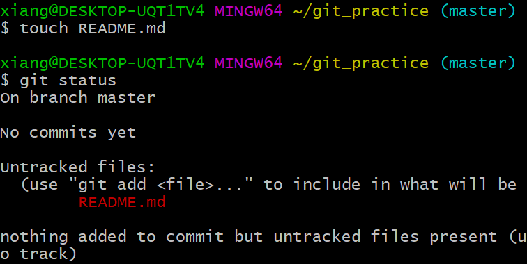
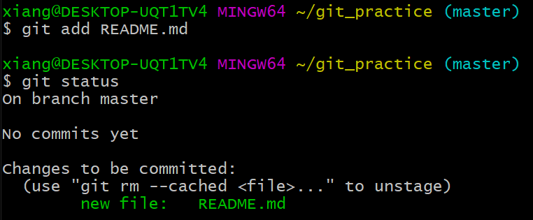
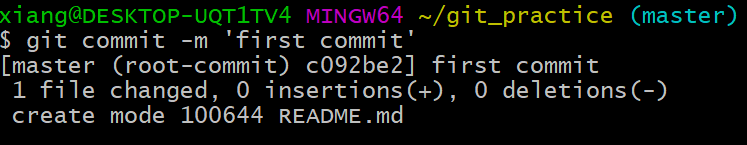
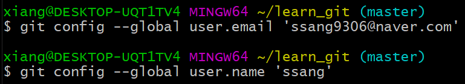
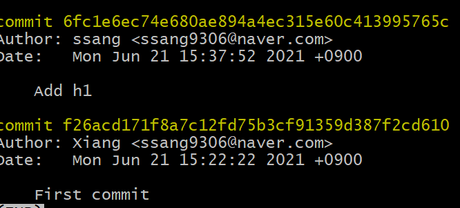

# Git 기초 

> 멀티캠퍼스 git 특강 강의를 듣고 정리함.

## What is ...

Git은 개발에 관심있는 사람이라면, 모두 한번쯤 들어봤고 그만큼 많이 사용되는 VCS(Vserion Control System) 도구이다.

Version Control System 말 그대로 각 버전을 관리해 주는 것이다.

프로그래밍 뿐만 아니라 모든 작업에는 작업일지 관리가 필요하다. 

가령 집을 짓는 목수라고 한다면, '오늘은 화장실을 만들고 내일은 안방을 만들어간다'라는 작업 목표에 맞춰 일을 할 것이다. 

여기서 집.version.01은 화장실 집.version.02는 안방일 것이다. 그 중에서도 version.01.01 "세면대 설치" version.01.02 "욕조설치"  version.01.01.02 "세면대 수리" 등으로 세분화 시킬 수 있을 것이다.

이처럼 프로그래밍 작업에서 각각의 버전을 만들고 이를 관리하는 가장 강력한 도구가 git이다. 프로그래밍 환경에서 각각의 버전은 오류 수정, 기능 추가 등이 있을 수 있고, 이러한 관리도구를 통해 이전 작업시점으로 돌아갈 수도 있다. 따라서 소프트웨어를 유지하고 발전시키기 위해서 이러한 버전 관리도구는 필수일 것이다.

### git != github

git을 통해 나의 작업을 수행하고 각각의 작업 진행사항을 저장했다면, git hub 서버를 통해 다른 사람의 작업사항을 공유 받을 수 있다.

작업은 각각의 로컬환경에서 진행되기 때문에 인터넷이 연결되어 있지 않거나, 서버에 문제가 발생했을때도 작업을 이어갈 수 있다. 

또한, 서버에 전체 작업에 대한 내용이 저장되어 있기 때문에 로컬 컴퓨터에 문제가 생겨도 언제든지 서버에서 작업내용을 전송 받아 작업을 이어갈 수 있다.

### 블로그처럼 이용하자!

처음 git에 대해 이해하고 생각한것은 일개 혼자 공부하는 단계인 나에게 git은 거창하다는 것이다. 

물론 협업에 최적화되어 다수의 사람과 함께하는 프로젝트에서 그 기능이 빛나겠지만 단순한 문서 또한 관리가 가능하다는 것이다.

특히, 개인이 공부한 내용의 저장또한 가능하다. 일종의 블로그라고 생각하면 된다.

자신이 공부한 내용을 깃에 정리하고 언제든지 꺼내읽을 수 있다. 또, 공부 내용에 오류를 떠올렸다면 언제든 버전관리하듯 문서를 수정하면 된다. 나도 앞으로 TIL(Today I Learned...)를 채워가는것이 목표이다.

## Why?

- 가장 많이 사용되는 협업-버전 관리도구
- 무료(오픈소스)
- 로컬 - 온라인의 융합
- ~~쉬운 사용법~~ (어렵지만... 기본적인건 쉽게 익힐 수 있다)

이 외에 git에 대한 기본적인 내용은 [엘리](https://youtu.be/lPrxhA4PLoA)님이 잘 설명해 주신 영상이 있다.

## How to...


### 저장소 초기화

``` 
$ git init
```

새로운 폴더를 만들면 아무것도 만들어 있지 않은 폴더가 있다.

여기서 `git init` 을 수행해 주면 폴더에 git 기능이 추가된다.

이렇게 기능을 추가된 폴더를 리포지토리, 저장소라고 할 수 있다.



base위치에서 git_practice를 생성하였고, git practice로 이동했다.



여기서 저장소를 초기화 해주지 않았기 때문에 아직 git과 관련된 아무것도 확인할 수 없다.



`git init` 으로 초기화 해 주면 해당 디렉토리에서 하늘색으로 (master)가 생성되고, .git폴더가 생성되는 것을 확인할 수 있다.


**!Tip**

1. git_practice같이 이름이 긴 파일들을 타이핑 할때, `tap`을 활용하자. 두 번 연속 누르면 해당 글자로 시작하는 파일 목록을 보여주고, 해당 문자열과 일치하는 파일명이 유일하다면 자동완성 된다.
2. ls 명령어의 폴더, 파일 목록에서 .으로 시작하는것은 숨김파일을 의미한다. 즉, 위의 초기화 된 리파짓토리에는 3개의 파일이 존재하는 것이다. 특히 .으로 표시되는 것은 윈도우가 아닌 리눅스의 특징이라고 하는데... 그렇다고 한다.
3. $는 prompt를 의미하며, 명령어를 수행할 준비가 되었다는 뜻이다. 다시 말해서 $가 없으면 명령어 입력이 안된다.


### 저장소를 일반 디렉토리로 초기화

```
$ rm -rf .git
```

Git은 폴더기준으로 관리를 하게 된다. 

 따라서 프로젝트 혹은 관리하고 싶은 폴더에서 git init을 수행해줘야 한다. 만약 홈 디렉토리에서 git init을 수행하면 내 컴퓨터에 모든 파일을 대상으로 리포짓토리를 생성하는 것이므로 주의하자.

만약 실수로 git을 설정해주었다면 rm -rf .git을 통해 git과 관련된 모든 폴더를 삭제해 주도록 하자.




### git status

```
$ git status
```

 status, 말그대로 상태를 보여주는 것이다.

 git에는 3가지 상태(영역)이 있다.

1. 작업
2. stage
3. commit

git은 각 버전을 스냅샷(사진)을 통해 관리한다고 하는데, 이해를 위해 촬영장에 비유해 보자.

촬영장에서 연예인이 촬영을 하기 까지 1. 무대에 오르기전 분장 2. 촬영 무대에 오르기 3. 촬영 3가지 단계가 있을 것이다.

먼저 우리가 하는 작업이 무대에 오르기 전 분장이라고 생각하면 된다.  연예인(작업물)이 이쁘게 나오기 위해 우리는 노력한다. 이곳이 작업 영역이다. 

예뻐진 연예인이 촬영 무대에 올라가고 이것이 stage 영역이며, add를 통해 stage로 보낼 수 있다(staging)

무대에서 촬영이 끝나면 최종 결과물이 사진으로 나오게 되며 이것이 commit 작업(영역)이다.



status로 확인했을때 크게 3가지 확인점이 있다.

- 초록색 글씨가 분장(작업)을 끝낸 연예인(작업물)이다. 현재 stage에 있고, commit을 통해 작업물을 확정 지을 수 있다.
- modified는 촬영을 하고 수정을 한 작업물이다. 다시 stage에 올려 commit할 필요가 있다.
- untracked files는 아직 분장하지 않은 연예인이다. 작업을 끝냈다면, add를 통해 stage로 올릴 필요가 있다.

### git add

``` 
$ git add <File Name>
$ git status
$ git commit -m 'message'
```

실질적인 파일 관리의 시작점이다.



먼저 `touch ` 명령어로 파일 하나를 만들어 주었다. 

그리고 `status` 로 상태를 확인해 보면, untracked files ~~ 라며 빨간색으로 추적되지 않은 파일이 존재한다.

친절히 use 'git add <file> ...' 라고 다음 수행해야할 동작을 알려주기도 한다.

​	**git add**



 앞서 만든 파일에 대해 git add를 수행해 주었다. 

 아까와 다르게 초록색으로 파일이름이 변경된 것을 확인할 수 있다. 이제 저장될 준비가 된 파일을 commit 할 수 있다.

```
$ git add .
```

현재 위치의 모든 파일을 스테이지에 올리기


### git commit



`git commit -m 'message'`

add 되어있는 파일을 commit한다. 'message'에 변경된 사항을 적어주도록 한다. ex) 파일 오타 수정 ....

영어로 많이 적혀있는데 대충 해석해 보면 정상적으로 커밋 됐다는것 같다.

​	**user 등록**



user 관련 메시지와 함께 commit이 수행되지 않는다면 다음과 같은 명령을 통해 사용자를 추가해준다.

`git config --global user.email 'Email'`

`git config --global use.name 'username'`


### git log

 ```
 $ git log
 $ git log --oneline
 ```

git log는 말그대로 변경이력을 보여준다. --oneline option으로 간단하게 출력해 볼 수 있다.



내용이 길어지면 키보드 방향키를 통해 위아래로 움직일 수 있고 나올때는 `q`를 통해 다시 콘솔창으로 돌아올 수 있다.

### 리모트

- github 즉, 온라인 리포지토리를 remote 라고 한다.
- 로컬에 commit 된 결과물을 remote 리포지토리로 push!
- 로컬의 각 리포와 remote 리포는 1:n으로 연결할 수 있다.
  - 마치 내 사진을 google drive, my box, drop box에 업로드 하듯 하나의 로컬 리포짓토리를 github, bitbucket, gitlab 등으로 연결할 수 있다.

1. Github remote 리포짓을 생성한다.
2. local과 remote를 연결
3. 실제 업로드 

#### 연결 & 정보 & 삭제

```
$ git remote add <name> <URL>
$ git remote add origin https://github.com/~~
# 연결 정보 확인
$ git remote -v

# 이름 수정
$ git remote rename <old name> <new name>

# 연결 삭제
$ git remote remove <name>
```

#### 도움말

```
$ git remote --help
```

#### 리모트 push

```
$ git push origin master
```

 The requested URL returned error: 403 에러가 떴다. 

`remtote add origin `를 통해 명칭을 만들었지만 주소에 권한이 없어서 발생되는 오류라고 한다.

두 가지 방법이 있다.

- 윈도우 검색 - 자격증명 관리자 - windows 자격증명 - 일반자격증명 -  git 관련 자격증명 삭제 후 add 부터 재시도
- `git remote set-url origin https://<github-username>@github.com/<github-username>/<github-repository-name> `
   * < > 에는 자신에 맞게 작성

**!**  처음 깃허브 팁을 보면 `git push origin main` 이라는 명령어를 알려주지만, bash 에서 마지막에 (master)라고 보여진다면 main이 아닌 master가 맞다.

####  리모트 PULL

```
$ git clone <URL.git>
```

 다른 컴퓨터에서 최초로 리모트 내용을 복사한다.

 최초에 단 한번만 `clone`을 수행하면 된다. 절때로, 두번 이상 클론하지말것!

```
$ git pull <name> <branch>
$ git pull origin master
```


> 앉을때 Pull, 일어설때 Push
>
> Sit pull, Stand push


## Don't Do That!

1. Home 폴더(~)를 리포지토리로 업그레이드 하지 않는다.

2. 리포 안의 폴더에서 리포를 만들지 않는다. (리포 하위 폴더에서 `git init`하지 않는다.)

   

