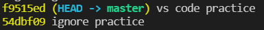
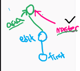
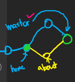
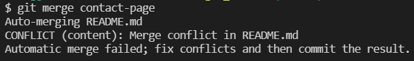
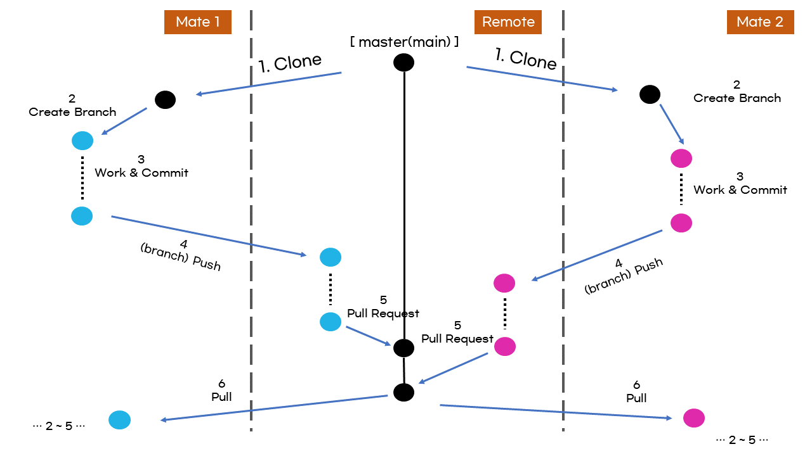

# Git Intermediate

> Git 중급이라고 할 수 있다
>
>  ignore, branch 정보

## commit 메시지 바꾸기

직전 커밋만 바꿀 수 있다.

```
$ git commit --amend

# vim 화면 등장 -> 메시지 수정 후 :wq
```


## Git ignore

[프로젝트에 맞는 ignore 생성](https://www.toptal.com/developers/gitignore)

접속하여 사용하는 툴을 적고, 나오는 내용 전체를 복사

-> .gitignore에 붙여넣기

**!** 프로젝트마다 (각 리포지토리마다) git ignore가 필요하다.

## Local Branching

**branch?**

 sw 개발시, 기능 단위로 브랜치를 만들어서 작업을 할 수 있다.

1. 가장 기본적인 master branch
2. 기능 단위로 branch를 만들어 작업한다.
3.  merge를 통해 병합!

**master branch?**

브렌치를 만들게(따게)되면, 현재 브랜치의 모든 상황을 복사하여, 새로운 공간을 만든다.




- master(branch)는 마지막 commit한 지점을 의미한다.
- HEAD는 지금 위치한 공간을 의미한다.
- `git log`를 통해 확인 할 수 있는 번호가 각 commit 의 PK이다.

### 이전시점으로 이동

```
$ git checkout <commit_num>
# like this
$ git checkout 54dbf09
```

### master(최종시점)으로 이동

``` 
$ git checkout master
```

### Create Branch

```
# 브랜치 생성
$ git branch <new-branch-name>

# 브랜치 목록 확인
$ git branch

# 브랜치 이동
$ git switch <branch-name>

# 브랜치 생성 후 이동
$ git switch -c <new-branch-name>

# 브랜치별 로그를 그래프로 확인
$ git log --oneline --graph
```



- master 브랜치까지 작업된 내용에서 새로운 브랜치를 생성
- master 내용에 더해 aaa 브랜치 만의 작업내용을 추가시킬 수 있다.
- switch로 aaa branch공간에서 작업을 하고 commit을 하면 aaa 공간만의 새로운 작업내용 사진이 저장된다.
- 다시  `switch master`로 돌아온다면, aaa에서의 작업내용은 master에서 보이지 않는다.
- 만약 aaa공간에서 작업을 하다가 문제가 생기면 브랜치 연결을 삭제하여 aaa에서의 작업을 삭제할 수 있다.
- 즉, 마스터 브랜치는 실제 동작하는 소프트웨어의 결과물이다고, 브랜치는 실험적 공간이다.

### Merge

#### 1. Fast Forwarding(꽃길)

- 보통 브랜치를 사용하지만 혼자 작업할때의 경우 
- 완료된 브랜치 작업을 마스터 브랜치가 따라감

##### Example

```
(master)
$ git branch br1

(master)
$ git switch br1

(br1)
$

# --- 작업 수정 완료 --- 

(br1)
$ git add . 
$ git commit -m 'branch example 1'
$ git switch master

# 완료된 branch작업 공간을 마스터작업이 따라간다.
(master)
$ git merge br1
```


#### 2. Conflict - Auto merge(충돌 & 자동 병합)



1. `about` 브랜치 수정

2. `master` 브랜치 수정

3. `(master) $ git merge about`

4. 운이 좋아 두 커밋의 수정내용이 겹치지 않음

5. 자동으로 merge되고, commit이 완료된다.

   

#### 3. Conflict - Manual merge(충돌 & 수동 병합)



1. `contact-page` 브랜치 수정
2. `master` 브랜치 수정
3. `(master) $ git merge contact-page`
4. 두 커밋의 작업(수정) 내용이 겹쳐서 충돌하는 구간이 존재
5. 수동으로 충돌 해결 후 저장
   - 단순 코드(텍스트) 덩어리는 텍스트 수정하듯 수정하면 처리 가능 --> 복잡한 과정 x, vscode는 클릭을 통해 수정하는 기능을 제공
6. 직접 `git add . ` , `git commit`  
   - `commit`을 실행해야 `merge`가 종료된다.

> merge 방법 자체는 3가지 모두 같다.
>
> ```
> $ <subject branch - master> git merge <object branch - branch1...>
> ```

### Delete Branch

```
# merge 완료된 브랜치 완전 삭제
# 작업 완료된 브랜치는 삭제하는 것이 옳다.
$ git branch -d <branch-name>

# merge 미완료된 브랜치 강제 삭제
$ git branch -D <branch-name>
```

## Collaborating

###  Warning 주의사항

- 마스터에서 작업하지 않는다. 각 기능에 맞는 브랜치를 생성해서 작업한다.
- 마스터의 변경(merge)은 리모트에서만 수행된다.
- 작업의 중심은 로컬, 협업의 중심은 리모트
- 따라서 협업 프로젝트의 리포지토리는 리모트에서 생성한다.

### 협업 진행

1. 팀장이 리모트 리포지토리를 생성한다.

   - `README.md`, `.gitignore`을 포함한 리포 생성
   - `setting => manage access`에서 팀원 추가

2. 팀원 각자 로컬 환경에 클론

   - ```
     $ git clone <URL> <dir-name> 
     
     #ex) - login 폴더를 만들어서 해당 폴더로 리포지토리 생성
     $ git clone https://github.com/ssang9306/collabo.git login 
     ```

   - dir name을 생성할경우 dir name에 맞게 폴더가 생성된다. default : 리포 이름

3. 자신이 제작하는 기능에 맞는 브랜치 생성 및 개발

   - ```
     $ git switch -c <작업/func-name>
     
     # ex) login 기능을 만드는 브랜치를 생성하고 이동
     $ git switch -c feature/login
     ```

4. 개발 완료 후, 해당 브랜치 내용을 리모트로 push, 이때 마스터 브랜치가 아닌 해당 브랜치로 push! 

   - ```
     $ git push <name> <branch-name>
     
     # ex) origin 이름으로 feature/login push
     $ git push origin featuer/login
     ```

5. 코드 작성자가 리모트에서 `Pull Request(Merge Request)` 

   - 결제 요청 진행, md 형식으로 상세한 내용 기술
   - `compare & request` 버튼 => 마스터 브랜치로 병합 요청
   - 설정을 통해 `reviewer`,`assigners` 등 지정 가능

6. 팀의 합의에 따라 변경된 내용을 마스터로 병합

   - `merge pull request`  => 병합 진행(충돌 x)
   - `close pull request`  => 병합 거부

7.  추가개발 - 개발자가 변경된 마스터를 불러와 작업 

   1.  로컬 브랜치를 마스터로 변경
   2.  리모트에서 변경된 마스터를 불러오기
   3.  다시 기능에 맞는 브랜치를 생성해 작업 시작... 반복

   ```
   # local branch on master
   $ git switch master
   
   # pull changed master branch
   $ git pull origin master
   ```

   - pull을 통해 내가 작업하지 않은 전체 브랜치의 commit 정보를 가져오지만, 브랜치 자체가 pull 되지 않는다.
   - github에서는 master라는 단어에서 main이라는 단어로 변환되고 있다. 리포 생성시 설정을 통해 변경 가능하다.

#### 충돌 상황 Conflict - Manual

- 각 팀원의 작업내용이 겹칠경우 충돌이 발생한다.
- 충돌이 발생할 경우, 팀원들과 논의를 통해 수정방향을 결정한다. `file change` 탭에서는 각 라인에 대해 피드백 할 수 있다.
- 최종 결정권자가 충돌을 제거하는 수정방향을 결정하고 코드가 수정 되었다면 `resolve conflict` 버튼을 통해 병합할 수 있다.  




