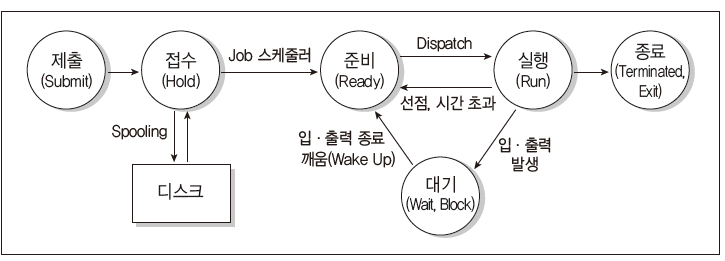
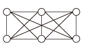
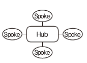
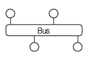
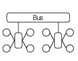

# 정보처리기사-실기

> '시나공' 문제집 풀면서 틀린/헷갈린 문제 위주의 정리
>
> 시험에 나온 키워드는 🍺로 별도 표기
>
> 처음 나온 개념은 포괄적으로, 한번 나온 개념은 부분 집중적으로 기술
>
> 합격 plz

## 20년 4-5회 통합

### 2. 디자인 패턴 Design Pattern

- 1995년 **GoF**(Gang of Four)가 구체화 및 체계화 

- 가장 **일반적인 사례에 적용 될 수 있는 패턴**들을 분류하여 정리, 지금까지도 소프트웨어 공학-현업에서 많이 사용됨

- 생성(5), 구조(7), 행위(11) 3가지로 분류 23개의 패턴

  - 생성 Creational Pattern🍺

     객체의 생성과 참조 과정을 **캡슐화**하여 객체의 생성, 변경에 따른 프로그램의 영향을 최소화 하고 프로그램에 **유연성**을 더함 

    - 추상팩토리 Abstract Factory

      인터페이스를 통해 서로 연관-의존 하는 객체들의 그룹으로 생성하여 추상적으로 표현한다. 

    - 빌더 Builder 

      작게 분리된 인스턴스를 건축 하듯이 조합하여 객체를 생성한다.

    - 팩토리 메소드 Factory Method

      객체 생성을 서브 클래스에서 처리하도록 분리하여 캡슐화한 패턴이다. 

    - 프로토타입 Prototype

      원본 객체를 복제하는 방법으로 객체를 생성하는 패턴이다.

    - 싱글톤 Singleton

      하나의 객체를 생성하면 생성된 객체를 어디서든 참조할 수 있지만, 동시에 여러 프로세스 참조 불가하다.

  - 구조 Structual Pattern🍺

    클래스나 객체를 조합해 더 큰 구조를 만들 수 있게 하는 패턴으로 복잡한 구조의 시스템을 쉽게 개발 할 수 있도록 도와준다.

    - 어댑터 Adapter

      호환성이 없는 클래스들의 인터페이스를 다른 클래스가 이용할 수 있도록 변환해주는 패턴이다.

    - 브리지 Bridge

      구현부에서 추상층을 분리, 서로가 독립적으로 확장할 수 있도록 구성한 패턴이다. 

    - 컴포지트 Composite

      여러 객체를 가진 복합 객체와 단일 객체를 구분 없이 다루고자 할 때 사용하는 패턴이다. 

    - 데코레이터 Decorator

      객체 간의 결합을 통해 능동적으로 기능을 확장할 수 있는 패턴이다. 

    - 퍼싸드 Facade 

      복잡한 서브 클래스들을 피해 더 상위에 인터페이스를 구성함으로써 서브 클래스들의 기능을 간편하게 사용할 수 있도록 하는 패턴이다. 

    - 플라이웨이트 Flyweight

      인스턴스가 필요할때 가능한 한 공유해서 사용함으로써 메모리를 절약하는 패턴이다.

    - 프록시 Proxy

      접근이 어려운 객체와 연결하려는 객체 사이에서 인터페이스 역할을 수행하는 패턴이다. 

  - 행위 패턴 Behavioral Pattern 🍺

    ​	클래스나 객체들이 서로 상호작용하는 방법, 책임 분배 방법을 정의하는 패턴이다. 

    - 책임 연쇄 Chain of Responsibility

      요청을 처리할 수 있는 객체가 둘 이상 존재하여 한 객체가 처리하지 못하면 다음객체로 넘어가는 형태의 패턴

    - 커맨드 Command

      요청을 객체의 형태로 캡슐화하여 재이용하거나 취소할 수 있도록 요청에 필요한 정보를 저장하거나 로그에 남기는 패턴

    - 인터프리터 Interpreter

      언어에 문법 표현을 정의하는 패턴이다. 

    - 반복자 Iterator

      자료구조와 같이 접근이 잦은 객체에 대해 동일한 인터페이스를 사용하도록 하는 패턴이다. 

    - 중재자 Mediator 

      수많은 객체들 간의 복잡한 상호작용을 캡슐화하여 객체로 정의하는 패턴이다. 

    - 메멘토 Memento

      특정 시점에서의 객체 내부 상태를 객체화함으로써 이후 요청에 따라 객체를 해당 시점의 상태로 돌릴 수 있는 기능을 제공하는 패턴이다.

    - 옵서버 Observer

      한 객체의 상태가 변화하면 객체에 상속된 다른 객체들에게 변화된 상태를 전달하는 패턴이다.

    - 상태 State

      객체의 상태에 따라 동일한 동작을 다르게 처리해야 할 때 사용하는 패턴이다.

    - 전략 Strategy

      동일한 계열의 알고리즘들을 개별적으로 캡슐화하여 상호 교환할 수 있게 정의하는 패턴이다. 

    - 템플릿 메소드 Template Method

      상위 클래스에서 골격을 정의하고, 하위 클래스에서 세부처리를 구체화하는 구조의 패턴이다.

    - 방문자 Visitor

      각 클래스들의 데이터 구조에서 처리기능을 분리하여 별도의 클래스로 구성하는 패턴이다. 

### 3. 다이어그램 Diagram

- 사물과 관계를 도형으로 표현한 것

- 여러 관점에서 시스템을 가시화 한 뷰 제공 -> 의사소통

  - 정적 모델링 - 구조적 다이어그램 
  - 동적 모델링 - 행위 다이어그램

- 구조적 Structural 다이어그램 종류

  - 클래스 다이어그램 Class Diagram

    클래스와 클래스가 가지는 속성, 클래스 사이의 관계를 표시,

    시스템 구조를 파악, 구조상 문제 도출

  - 객체 다이어그램 Object Diagram

    클래스에 속한 사물(인스턴스)을 특정 시점의 객체와 객체 사이의 관게로 표현

    **럼바우** 객체지향 분석기법의 객체 모델링에 활용

  - 컴포넌트 다이어그램 Component Diagram

    실제 구현 모듈인 컴포넌트 간의 관계, 컴포넌트간의 인터페이스 표현

    구현 단계에서 사용

  - 배치 다이어그램 Deployment Diagram

    결과물, 프로세스, 컴포넌트 등 물리적 요소들의 위치 표현

    노드와 통신 경로로 표현, 구현단계에서 사용

  - 복합체 구조 다이어그램 Composite Structure Diagram

    클래스나 컴포넌트가 복합 구조를 갖는 경우 내부 표현

  - 패키지 다이어그램 Package Diagram 🍺

    유스케이스나 클래스 등의 모델 요소들을 그룹화한 패키지들의 관계를 표현

- 행위 Behavioral 다이어그램

  - 유스케이스 다이어그램 Use Case Diagram

    사용자의 요구를 분석하는 것으로 기능 모델링 작업에 활용

    사용자(Actor)와 사용 사례(Use Case)로 구성, 사용 사례 간에는 여러 형태의 관계

  - 시퀀스 다이어그램 Sequence Diagram

    상호 작용하는 시스템이나 객체들이 주고받는 메시지 표현

  - 커뮤니케이션 다이어그램 Communication Diagram

    동작에 참여하는 객체들이 주고받는 메시지, 객체간 연관 표현

  - 상태 다이어그램 State Diagram

    하나의 객체가 자신이 속한 클래스의 상태 변화, 다른 객체와의 상호 작용에 따라 상태가 어떻게 변하는지 표현

    **럼바우** 객체지향 분석 기법에서 동적 모델링에 활용

  - 활동 다이어그램 Activity Diagram

    시스템이 어떤 기능을 수행하는지 객체의 처리 로직이나 조건에 따른 처리의 흐름을 순서에 따라 표현

  - 상호작용 개요 다이어그램 Interaction Overview Diagram

    상호작용 다이어그램 간의 제어 흐름을 표현

  - 타이밍 다이어그램 Timing Diagram

    객체 상태 변화와 시간 제약을 명시적으로 표현

### 4. 데이터베이스 회복 기법

- 트랜잭션들을 수행하는 도중 장애가 발생하여 DB가 손상되었을 때 손상되기 이전의 정상 상태로 복구하는 작업
- 연기 갱신기법 Deferred Update
  - 트랜잭션이 성공적으로 완료될 때까지 데이터베이스에 대한 실질적인 갱신을 연기하는 방법
  - 트랜잭션 수행동안 갱신내용은 Log에 보관
  - 트랜잭션의 부분 완료 시점에 Log에 보관한 갱신 내용을 실제 데이터베이스에 기록
  - 트랜잭션이 부분 완료되기 전에 장애가 발생하여 Rollback 되면 트랜잭션이 실제 데이터베이스에 영향을 미치지 않았기 때문에 어떠한 갱신 내용도 취소(Undo)시킬 필요 없이 무시
  - Redo만 가능
- 즉각 갱신기법 Immediate Update🍺
  - 트랜잭션이 데이터를 갱신하면 트랜잭션이 부분완료되기 전이라도 즉시 실제 DB에 반영하는 방법
  - 장애가 발생시 회복 작업을 대비해 갱신된 내용을 Log에 보관
  - Redo, Undo 모두 가능
- 그림자 페이지 대체 기법 Shadow Paging
  - 갱신 이전의 DB를 일정 크기의 페이지 단위로 구성해 각 페이지마다 복사본인 그림자 페이지로 별도 보관, 실제 페이지 갱신작업을 하다가 장애가 발생해 rollback 시킬 때, 갱신 이후의 실제 페이지를 그림자 페이지로 대체하여 회복
  - Log, Undo, Redo 필요 없음
- 검사점 기법 Check Point 
  - 트랜잭션 실행 중 특정 단계에서 재실행할 수 있도록 갱신 내용, 시스템 상황 등의 정보와 함께 검사점을 로그에 보관, 장애 발생시 검사점부터 회복 작업을 수행하여 회복시간 절약

### 6. 공격기법

1. 랜드어택 Land Attack
   - 공격자가 패킷의 출발지와 목적지 **주소를 동일하게 변경**
   - 공격 대상의 컴퓨터 실행속도가 느려지거나 동작이 마비
2. 스머핑
   - 출발지 주소를 공격 대상의 IP로 설정
   - 네트워크 전체에 ICMP Echo 패킷을 직접 브로드캐스팅하여 타겟 시스템을 마비 
3. Ping of death
   - 큰 사이즈 패킷을 의도적으로 목표 시스템으로 발생시켜 시스템 마비
4. HTTP GET flooding
   - DDos 공격기법 중 HTTP 기반의 응용계층 공격
   - 과도한 get 메시지를 이용하여 웹서버의 과부하를 유발
5. 스니핑 sniffing 🍺
   - 냄새를 맡다, 킁킁거리다
   - 네트워크 중간에서 남의 패킷 정보를 도청하는 해킹 유형
   - 공격대상에게 직접 공격하지 않고, 데이터만 들여다보는 수동적 기술
6. 스푸핑 spoofing
   - 속이다, 사기치다
   - TCP/IP의 구조적 결함을 이용해 사용자의 시스템 권한을 획득하여 정보를 빼가는 해킹 수법
7. Session hijacking
   - TCP 신뢰성 기반 연결을 이용, 통신 내용을 엿보거나 세션을 가로채어 정상적 인증과정을 무시, 불법으로 시스템에 접근
8. 스미싱 Smishing 
   - SMS + fishing -> sms로 사람 낚기
   - 신뢰할 수 있는 사람/ 기업이 보낸 것처럼 가장하여 개인 비밀번호 요구/ 소액 결제 유도 
   - QR코드를 이용한 Qshing
9. spear phishing
   - 스미싱과 유사, 특정 개인이나 회사들을 대상으로 하는 피싱
10. KEY logger attack
    -  사용자의 키보드 움직임을 탐지해 ID, pwd, 계좌번호 등 개인의 중요한 정보를 몰래 빼가는 해킹 공격
11. 웜 바이러스
    - 스스로를 복제하는 악성 소프트웨어 컴퓨터 프로그램
12. 크로스 사이트 스크립트 XSS
    - 웹페이지에 악의적 스크립트를 작성하여 방문자들의 정보를 탈취하거나 비정상적 기능 수행을 유발하는 보안 약점
    - HTML 태그 사용을 제한하거나 스크립트에 삽입되지 않도록 <, > & 등의 문자를 다른문자로 치환함으로써 방지
13. SQL injection
    - 웹 응용 프로그램에 SQL을 삽입하여 내부 데이터베이스 서버의 데이터를 유출 및 변조하고, 관리자 인증을 우회하는 보안 약점
14. 제로데이 공격
    - 발견된 보안 취약점의 존재 자체가 널리 공표되기 전에 해당 취약점을 통하여 이루어지는 보안 공격으로, 공격의 신속성을 의미
15. 스파이웨어 spyware
    - 사용자의 동의 없이 설치되어 컴퓨터의 정보를 수집하고 전송하는 악성 소프트웨어
16. 랜섬웨어 Ransomware
    - 인터넷 사용자의 컴퓨터에 잠입해 내부 문서나 파일 등을 암호화하여 사용자가 열지 못하게 하는 프로그램으로 암호 해독용 프로그램의 전달을 조건으로 사용자에게 돈을 요구
17. 백도어 Back Door
    -  서비스 기술자나 유지 보수 프로그램 작성자의 액세스 편의를 위해 시스템 보안을 제거하여 만들어 놓은 비밀통로로, 범죄에 악용되기도 함
    - 무결성 검사, 열린 포트 확인, 로그 분석, SetUID 파일검사 등을 통해 방지
18. 트로이 목마 Trojan Horse
    - 정상 기능 프로그램으로 위장하여 프로그램 내에 숨어 있다가 프로그램이 동작할 때 활성화 되어 부작용을 일으킴, 자기 복제능력은 없다.
19. 웜 Worm
    - 네트워크를 통해 자신을 복제, 시스템 부하를 높임으로써 시스템을 다운시키는 바이러스
    - 분산 서비스 거부 공격, 버퍼 오버플로우 공격, 슬래머 등
20. 봇넷 Botnet
    - 악성 프로그램에 감염되어 악의적 의도로 사용될 수 있는 다수의 컴퓨터들이 네트워크로 연결된 형태
21. C&C 서버
    - 해커가 원격지에서 감염된 좀비 PC에 명령을 내리고 악성코드를 제어하기 위한 용도로 사용하는 서버
22. 좀비Zombie PC
    - 악성 코드에 감염되어 다른 프로그램이나 컴퓨터를 조종하도록 만들어진 컴퓨터로 C&C서버의 제어를 받아 DDoS 공격 등에 이용

### 11. NAT

- 라우터를 통해 네트워크 트래픽을 주고 받는 기술로써 네트워크 주소 변환🍺

### 13. 테스트케이스/ 테스트시나리오/테스트 오라클

- 테스트 케이스 Test Case

  - 명세 기반 테스트의 설계 산출물
  -  구현된 소프트웨어가 사용자의 요구사항을 정확하게 준수했는지를 확인하기 위해 설계된 입력 값, 실행 조건, 기대 결과 등으로 구성된 테스트 항목에 대한 명세서
  - 테스트 오류를 방지할 수 있고, 필요한 인력, 시간 등의 낭비를 줄일 수 있다.

- 테스트 시나리오 Test Scenario

  - 테스트 케이스를 적용 순서에 따라 여러개의 테스트 케이스들을 묶은 집합으로 테스트 케이스들을 적용하는 구체적인 절차를 명세한 문서
  - 테스트 순서에 대한 구체적 절차, 사전조건, 입력 데이터

- 테스트 오라클 Test Oracle 

  - 테스트 결과가 올바른지 판단하기 위해 사전 정의된 참 값을 대입하여 비교하는 기법 & 활동

  - 결과를 판단하기 위해 테스트 케이스에 대한 예상 결과를 계산, 확인 

  - 특징

    - 제한된검증 : 모든 테스트 케이스에 적용 할 수 없음
    - 수학적기법 : 테스트 오라클 값을 수학적 기법을 이용해 구할 수 있다.
    - 자동화기능 : 테스트 대상 프로그램 실행, 결과 비교, 커버리지 측정 등을 자동화 할 ㅜㅅ 있다.

  - 종류

    - 참True 오라클 

      모든 테스트 케이스의 입력 값에 대해 기대하는 결과를 제공하는 오라클, 발생된 모든 오류 검출 가능

    - 샘플링Sampling 오라클🍺

      특정 몇 테스트 케이스의 입력 값들에 대해서만 기대하는 결과를 제공하는 오라클

    - 추정Heuristic 오라클

      특정 테스트 케이스의 입력 값에 대해 기대하는 결과를 제공하고(샘플링오라클), +) 나머지 입력 값들에 대해서는 추정으로 처리

    - 일관성 검사Consistent 오라클

      애플리케이션의 변경이 있을 때, 테스트 케이스의 수행 전과 후의 결과 값이 동일한지를 확인하는 오라클

### 14 데이터베이스 이상(Anomaly)

- 정규화를 거치지 않으면 DB 데이터들이 불필요하게 중복되어 릴레이션 조작 시 예기치 못한 곤란한 현상이 발생하는데, 이를 이상이라 한다.
  - 삽입이상 Insertion Anomaly🍺
    - 릴레이션에 데이터를 삽입할 때 의도와는 상관없이 원하지 않는 값들도 함께 삽입되는 현상
  - 삭제이상 Deletion Anomaly🍺
    - 릴레이션에서 한 튜플을 삭제할 때 의도와는 상관없는 값들도 함께 삭제되는 연쇄가 일어나는 현상
  - 갱신이상 Update Anomaly🍺
    - 릴레이션에서 튜플에 있는 속성값을 갱신할 때 일부 튜플의 정보만 갱신되어 정보에 모순이 생기는 현상

### 15 블랙박스 테스트 Black Box Test 

- 소프트웨어가 수행할 특정 기능을 알기 위해 각 기능이 완전히 작동되는 것을 입증하는 테스트로, 기능테스트라고도 한다. 🍺

- 요구사항 명세를 보면서 테스트하는 것으로, 주로 구현된 기능을 테스트한다.

- 소프트웨어 인터페이스에서 실시되는 테스트이다

- 종류

  - 동치분할검사 Equivalance Partitioning Testing🍺

    입력 자료에 초점을 맞춰 테스트 케이스를 만들고 검사하는 방법, 동등 분할기법이라고도 함

    입력 조건에 타당한 입력 자료와 타당하지 않은 입력 자료의 개수를 균등하게 하여 테스트 케이스를 설정, 입력자료에 맞는 결과가 출력되는지 확인

  - 경계값 분석 Boundary Value Analysis

    동치 분할 기법을 보완

    입력 조건의 경계값을 테스트 케이스로 선정하여 검사하는 기법

  - 원인-효과 그래프 검사 Cause-Effect Graphing Testing

    입력 데이터 간의 관계, 출력에 영향을 미치는 상황을 체계적으로 분석한 후 효용성이 높은 테스트 케이스를 선정하여 검사하는 기법

  - 오류 예측 검사 Error Guessing

    과거 경험, 확인자의 감각으로 테스트 하는 기법

    다른 테스트 기법으로 찾아낼 수 없는 오류를 찾아내는 보충적 검사기법, 데이터 확인검사

  - 비교 검사 Comparison Testing

    여러 버전의 프로그램에 동일한 테스트 자료를 제공하여 동일한 결과가 출력되는지 테스트

### 17 프로세스 상태 전이

### 20 데이터베이스 보안

- 보안 3대요소: 

  기밀성 (Confidentiality) , 무결성 (Integrity), 가용성(Availabilty)

- 추가 : 인증 (Authentication), 부인 방지(NonRepudiation)

  - 기밀성 

    시스템 정보와 자원은 인가된 사용자에게만 **접근**이 허용

    정보 전송 중 노출되더라도 데이터를 읽을 수 없음

  - 무결성

    시스템 내의 정보는 오직 인가된 사용자만 **수정** 가능

  - 가용성🍺

    인가받은 사용자는 언제라도 **사용**할 수 있다.

  - 인증 

    자원을 사용하려는 사용자가 합법적 사용자인지 확인하는 모든 행위

    패스워드, 인증용 카드, 지문 검사 등

  - 부인방지

    데이터를 송-수신한 자가 송-수신 사실을 부인할 수 없도록 송-수신 증거를 제공

## 20년 3회

### 1. XP (eXtreme Programming)

- 수시로 발생하는 고객의 요구사항에 **유연하게 대응**하기 위해 고객의 **참여**와 개발 과정의 **반복**을 극대화하여 생산성을 향상시키는 방법
- 짧고 반복적인 개발 주기, 단순한 설계, 고객의 적극적 참여 -> 빠른 소프트웨어 개발
- 5대 핵심가치
  - 의사소통 Communication, 단순성 Simplicity, 용기 Courage, 존중 Respect, 피드백 Feedback

- 주요 실천 방법

  - 짝 프로그래밍 Pair Programming

    다른 사람과 함께 프로그래밍 수행, 개발에 대한 공동책임 환경

  - 공동 코드 소유 Collective Ownership

    개발 코드에 대한 권한과 책임을 공동 소유

  - 테스트 주도 개발 Test-Driven Development

    개발자가 코드 작성 전 테스트 케이스 작성하면서 자신이 무엇을 해야할지 파악

    테스트가 지속적으로 진행될 수 있도록 자동화된 테스팅 도구를 사용

  - 전체 팀 Whole Team

    개발에 참여하는 모든 구성원들은 각자 역할과 책임이 있다

  - 계속적인 통합 Continuous Integration

    모듈 단위로 나눠서 개발된 코드들은 하나의 작업이 마무리 될 때마다 지속적으로 통합

  - 디자인 개선 Design Improvement / 리팩토링 Refactoring

    프로그램 기능의 변경 없이, 단순화, 유연성 강화 등을 통해 시스템을 재구성🍺

    ==> **프로그램을 쉽게 이해하고 수정하여 빠르게 개발 할 수 있다.**🍺

  - 소규모 릴리즈 Small Releases

    릴리즈 기간을 짧게 반복함으로써 고객의 요구 변화에 신속한 대응

### 4. 인터넷 계층 주요 프로토콜

- IP(Internet Protocol) 

  전송할 데이터에 주소 지정, 경로 설정 기능

  비연결형인 데이터 그램방식 사용 - 신뢰성 보장 x 

- ICMP (Internet Control Message Protocol) 🍺

  IP와 조합하여 통신 중 발생하는 오류 처리와 전송 경로 변경 등을 위한 제어메시지를 관리하는 역할, 헤더는 8Byte

- IGMP (Internet Group Management Protocol)

  멀티캐스트를 지원하는 호스트나 라우터 사이에서 멀티캐스트 그룹 유지를 위해 사용

- ARP(Address Resolution Protocol)

  호스트 IP 주소를 호스트와 연결된 네트워크 접속 장치의 물리적 주소(MAC Address)로 바꿈 

- RARP(Reverse Address Resolution Protocol)

  ARP의 반대, 물리적 주소를 IP주소로 변환하는 기능

### 5. 데이터베이스 스키마 Schema

- 데이터베이스의 구조와 제약조건에 관한 전반적인 명세를 기술한 (메타데이터의 집합)🍺

- 개체(Entity), 속성(Attribute), 관계(Relationship) 및 데이터 조작 시 데이터 값들이 갖는 제약조건 등에 관해 전반적 정의

- 외부, 개념, 내부 스키마

  - 외부 스키마

    사용자나 응용 프로그래머가 각 개인의 입장에서 필요로하는 데이터베이스의 논리적 구조 정의 

  - 개념 스키마

    데이터베이스의 전체적인 논리적 구조, 모든 응용 프로그램이나 사용자들이 필요로 하는 데이터를 종합한 조직 전체의 데이터베이스

  - 내부 스키마

    물리적 저장장치 입장에서 본 데이터베이스 구조, 저장될 레코드의 형식, 저장 데이터 항목의 표현 방법, 내부 레코드의 물리적 순서 등

### 6. 프로토콜 

- 서로 다른 기기들 간의 데이터 교환을 원할하게 수행할 수 있도록 표준화시켜 놓은 통신 규약

- 컴퓨터가 메시지를 전달하고, 메시지가 제대로 도착했는지 확인하며, 도착하지 않았을 경우 메시지를 재전송하는 일련의 방법을 '기술적 은어'를 뜻하는 용어로 정의🍺

- 기본요소

  - 구문 Syntax

    전송하고자 하는 데이터 형식, 부호화, 신호 레벨 등 규정

  - 의미 Semantics

    두 기기 간 효율적이고 정확한 정보 전송을 위한 **협조 사항**과 오류 관리를 위한 **제어 정보**를 규정

  - 시간 Timing

    두 기기 간의 통신 속도, 메시지 순서 제어 등 규정

- 기능

  - 단편화와 재결합

    송신측에서 전송할 데이터를 작은 블록으로 자르는 작업을 단편화(Fragmentation), 수신 측에서 단편화된 블록을 원래 데이터로 모으는 것을 재결합(Reassembly)이라 한다.

  - 캡슐화

    단편화된 데이터에 송-수신지 주소, 오류 검출 코드, 프로토콜 제어 정보 등의 정보를 부가하는 것, 요약화

  - 흐름 제어

    수신 측의 처리 능력에 따라 송신 측에서 송신하는 데이터 전송량, 속도를 조절하는 기능

    정지-대기(Stop-and-Wait), 슬라이딩 윈도우(Sliding Window)

  - 오류 제어 Error Control

    전송중에 발생하는 오류를 검출, 정정하여 데이터와 제어정보의 파손에 대비

  - 동기화 Synchronization

    송-수신 측이 같은 상태를 유지하도록 타이밍을 맞추는 기능

  - 순서 제어 Sequencing

    전송되는 데이터 블록(PDU)에 전송 순서를 부여하는 기능, 연결 위주의 데이터 전송 방식에서만 사용

  - 주소 지정 Addressing

    데이터가 목적지까지 정확하게 전송될 수 있도록 목적지 이름, 주소, 경로를 부여하는 기능

  - 다중화 Multiplexing

    한 개의 통신 회선을 여러 가입자들이 동시에 사용하도록 하는 기능

  - 경로 제어 Routing

    송-수신 측 간의 송신 경로 중에서 최적의 패킷 교환 경로를 설정하는 기능

  - 전송 서비스

    전송하려는 데이터가 사용하도록 하는 별도의 부가 서비스

### 7. 관계대수

- 관계형 데이터베이스에서 원하는 정보와 그 정보를 검색하기 위해서 어떻게 유도하는가를 기술하는 절차적 언어

- 릴레이션을 처리하기 위해 연산자와 연산규칙을 제공하는 언어로 피연산자가 릴레이션, 결과도 릴레이션이다.

- 질의에 대한 해를 구하기 위해 수행해야 할 연산의 순서를 명시

- 순수관계 연산자, 수학적 집합 이론에서 사용하는 일반 집합 연산자

- 순수 관계 연산자

  - Select σ

    튜플 중 선택 조건을 만족하는 튜플의 부분집합 , 수평연산

  - Project π

    속성 리스트에서 제시된 속성 값만을 추출, 중복 제거, 수직연산

  - Join ⨝

    공통 속성을 중심으로 두 개의 릴레이션을 하나로 합침

  - Division ÷ 🍺

    릴레이션 R , S에서 R의 속성이 S 의 속성값을 모두 가진 튜플에서 S가 가진 속성을 제외한 속성만을 구하는 연산

    ==> 릴레이션 A, B가 있을 때 릴레이션 B의 조건에 맞는 것들만 릴레이션 A에서 분리하여 프로젝션하는 연산

- 일반 집합 연산자

  - UNION (합집합)
  - INTERSECTION (교집합)
  - DIFFERENCE (차집합)
  - CARTESIAN PRODUCT (교차곱)

### 8. 화이트박스 테스트 White Box Test

- 모듈의 원시 코드를 오픈시킨 상태에서 원시 코드의 논리적인 모든 경로를 테스트하여 테스트 케이스를 설계하는 방법

- 모듈 내 작동을 직접 관찰

- 원시 코드(모듈)의 모든 문장을 한 번 이상 실행함으로써 수행

- 종류

  - 기초 경로 검사 Base Path Testing

    대표적 화이트박스 테스트 기법

    설계자가 절차적 설계의 논리적 복잡성을 측정할 수 있게 해주는 테스트 기법으로, 테스트 측정 결과는 실행 **경로의 기초를 정의하는 지침**으로 사용

  - 제어 구조 검사 Control Structure Testing

    - 조건검사 Condition Testing

      프로그램 모듈 내에 있는 논리적 조건을 테스트

      IF - ELSE

    - 루프검사 Loop Testing

      프로그램의 반복 구조에 초점을 맞춰 실시하는 테스트

      for, while

    - 데이터 흐름 검사 Data Flow Testing

      프로그램에서 변수의 정의와 변수 사용의 위치에 초점을 맞춰 실시하는 테스트 

- 검증 기준

  - 문장 검증 기준 Statement Coverage

    소스 코드의 모든 구문이 한 번 이상 수행되도록 설계

  - 분기 검증 기준 Branch Coverage 🍺

    모든 조건문이 한 번 이상 수행되도록 설계

  - 조건 검증 기준 Condition Coverage

    소스 코드의 모든 조건문에 대해 조건이 TRUE/False인 경우가 한번 이상 수행되도록 테스트 케이스 설계

  - 분기/조건 기준 Branch/Condition Coverage

    모든 조건문과 조건문에 포함된 개별 조건식 결과가 TRUE, FALSE인 경우가 한 번 이상 수행되도록 설계

### 12. 형상 관리 - 형상 통제

1. 형상관리
   - 소프트웨어의 변경 사항을 관리하기 위한 활동

2. 형상관리 중요성
   - 변경사항을 지속적이고 체계적으로 관리 및 추적
   - 발견된 버그나 수정 사항 추적
   - 무절제한 변경 방지 
3. 형상관리 기능
   - 형상식별 : 대상에 이름과 관리번호를 부여하고 계층 구조로 구분하여 수정 및 추적이 용이하도록 하는 작업
   - 버전제어 : 소프트웨어 유지 보수 과정에서 생성된 다른 버전의 형상 항목을 관리하고 특정 절차와 도구를 결합 하는 작업
   - 형상 통제 : 식별된 형상 항목에 대한 변경 요구를 검토하여 현재의 기준선이 잘 반영될 수 있도록 하는 작업 🍺
   - 형상 감사 : 기준선의 무결성을 평가하기 위해 확인, 검증, 검열 과정을 통해 공식적으로 승인하는 작업
   - 형상 기록 : 형상의 식별, 통제, 감사, 작업의 결과를 기록, 관리하고 보고서를 작성하는 작업
4. 주요 용어
   - 저장소 Repository : 형상에 대한 정보들이 저장되어 있는 곳
   - 가져오기 Import : 아무것도 없는 저장소에 처음으로 파일 복사
   - 체크아웃 Check-Out: 저장소에서 소스 파일, 버전 관리를 위한 파일들을 받아옴
   - 체크인 Check-In : 체크아웃으로 받아온 파일을 수정 후 저장소에 새로운 버전으로 갱신
   - 커밋 Commit : 체크인 수행 시 이전에 갱신된 내용이 있는 경우 충돌을 알리고 diff 도구를 이용해 수정한 후 갱신완료
5. 동기화 Update : 저장소에 있는 최신 버전을 동기화

### 14. 변수 개요/ 변수명 작성 규칙

1. 변수 Variable
   - 컴퓨터가 명령을 처리하는 도중 발생하는 값을 저장하기 위한 공간, 변할 수 있는 값을 의미
   - 정수, 실수, 문자, 포인터 형

2. 작성 규칙
   - 영문자, 숫자, _(under bar)를 사용 할 수 있다.
   - 첫글자는 영문이나 _로 시작해야한다.
   - 글자수에 제한이 없다.
   - 공백이나 *, +, -, / 등의 특수문자를 사용할 수 없다.
   - 대-소문자를 구분한다.
   - 예약어를 변수명으로 사용할 수 없다.
   - 변수 선언 시 문장 끝에 반드시 세미콜론(;)을 붙여야 한다.
   - 변수 선언시 변수명에 타입을 명시하는 것을 헝가리안 표기법(Hungarian Notation)이라고 한다. 🍺

### 16. 경로제어(라우팅) 프로토콜 Routing Protocol

- 경로제어는 송-수신 측 간의 전송 경로 중에서 최적 패킷 교환 경로를 결정하는 기능

- 최적 패킷 교환 경로란 어느 한 경로에 데이터의 양이 집중하는 것을 피하면서, 최저의 비용으로 최단 시간에 송신할 수 있는 경로를 의미한다.

- 경로 제어 요소: 성능 기준, 경로의 결정 시간과 장소, 정보 발생지, 경로 정보의 갱신 시간

- 경로제어(라우팅) 프로토콜 Routing Protocol

  - GP ( Interior Gateway Protocol, 내부 게이트웨이 프로토콜)

    - 하나의 자율 시스템(AS) 내의 라우팅에 사용되는 프로토콜

    - RIP (Routing Information Protocol)

      현재 가장 널리 사용되는 라우팅 프로토콜

      거리벡터 라우팅 프로토콜

      최단 경로 탐색에 Bellman-Ford 알고리즘 사용

      소규모의 동종 네트워크(자율 시스템, AS)내에서 효율적

      최대 홉(Hop) 수를 15로 제한, 대규모 네트워크에서 사용 불가

    - OSPF(Open Shortest Path First protocol)🍺

      RIP의 단점 해결, 새로운 기능을 지원

      대규모 네트워크에서 많이 사용

      이용자가 최단 경로를 선정 할 수 있도록 라우팅 정보에 노드 간 거리 정보, 링크 상태 정보를 **실시간**으로 반영하여 최단 경로로 라우팅 제공

      최단경로 탐색에 다익스트라 Dijkstra 알고리즘 사용

      라우팅 정보에 변화가 생길 경우 변화된 정보만 네트워크 내의 모든 라우터에 알림

      하나의 자율 시스템(AS)에서 동작하면서 내부 라우팅 프로토콜의 그룹에 도달한다.

  - EGP ( Exterior Gateway Protocol, 외부 게이트웨이 프로토콜)

    - 자율 시스템(AS) 간의 라우팅, 즉 게이트웨이 간의 라우팅에 사용되는 프로토콜이다. 

  - BGP ( Border Gateway Protocol )

    - 자율 시스템(AS)간의 라우팅 간으 프로토콜
    - EGP의 단점을 보완하기 위해 만듬
    - 초기에 BGP 라우터 연결될 때에 전체 경로 제어표(라우팅 테이블)를 교환, 이후에는 변화된 정보만 교환

### 17 EAI 구축 유형

1. EAI

   - 기업 내 각종 애플리케이션 및 플랫폼 간의 정보 전달, 연계, 통합 등 상호 연동이 가능하게 해주는 서비스
   - 비즈니스 간 통합 및 연계성을 증대시켜 효율성 및 각 시스템 간의 확정성(Determinacy)을 높여 준다.

2. 유형

   - Point-to-Point 🍺

     

     가장 기본적 애플리케이션 통합 방식, 1:1연결

     변경 및 재사용이 어렵다.

   - Hub & Spoke 🍺

     

     단일 접점인 허브 시슽메을 통해 데이터를 전송하는 중앙 집중형 방식

     확장 및 유지보수 용이

     허브 장애 발생 시 시스템 전체 영향

   - Message Bus (ESB방식)

     

     애플리케이션 사이에 미들웨어를 두어 처리하는 방식

     확장성이 뛰어나며 대용량 처리 가능

   - Hybrid

     

     Hub & Spoke 와 Message Bus의 혼합 방식

     그룹 내에서는 Hub & Spoke, 그룹간에는 Message Bus방식

     필요한 경우 한 가지 방식으로 EAI 구현 가능

     데이터 병목 현상을 최소화

### 18 UI 설계 원칙

1. 사용자 인터페이스 UI, User Interface
   - 사용자와 시스템 간의 상호 작용이 원활하게 이뤄지도록 도와주는 장치나 소프트웨어
   - 사용자의 만족도에 가장 큰 영향을 미치는 중요한 요소
   - 변경이 가장 많이 발생
   - 사용자의 편리성과 가독성을 높임으로써 작업시간을 단축, 업무에 대한 이해도를 높임
   - 최소한의 노력으로 원하는 결과를 얻을 수 있게 한다.
2. 기본 원칙
   - 직관성 : 누구나 쉽게 이해하고 사용할 수 있어야 한다. 🍺
   - 유효성 : 사용자의 목적을 정확하고 완벽하게 달성해야 한다.
   - 학습성 : 누구나 쉽게 배우고 익힐 수 있어야 한다.
   - 유연성 : 사용자의 요구사항을 최대한 수용하고 실수를 최소화해야 한다.
3. UI 개발 시스템의 기능
   - 사용자의 입력을 검증할 수 있어야 한다.
   - 에러 처리와 그와 관련된 에러 메시지를 표시할 수 있어야 한다.
   - 도움과 프롬프트(Prompt)를 제공해야 한다.

### 19. 생성자 Constructor

C++의 생성자 

- **객체 변수 생성에 사용되는 메소드**로, 객체 변수를 생성하면서 초기화를 수행한다. 🍺

==> 추가 자료 필요 !!
