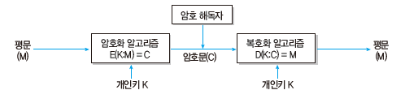
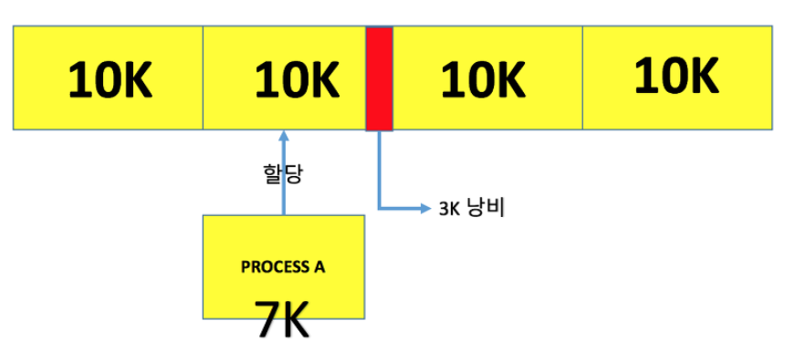
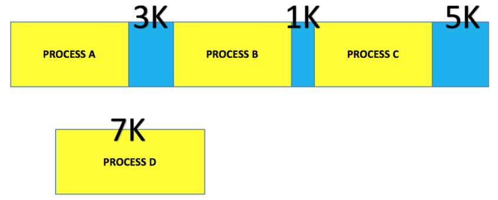

# 정보처리기사-실기

> '시나공' 문제집 풀면서 틀린/헷갈린 문제 위주의 정리
>
> 시험에 나온 키워드는 🍺로 별도 표기
>
> 처음 나온 개념은 포괄적으로, 한번 나온 개념은 부분 집중적으로 기술
>
> 합격 plz

## 20년 4-5회 통합

### 2. 디자인 패턴 Design Pattern

- 1995년 **GoF**(Gang of Four)가 구체화 및 체계화 

- 가장 **일반적인 사례에 적용 될 수 있는 패턴**들을 분류하여 정리, 지금까지도 소프트웨어 공학-현업에서 많이 사용됨

- 생성(5), 구조(7), 행위(11) 3가지로 분류 23개의 패턴

  - 생성 Creational Pattern🍺

     객체의 생성과 참조 과정을 **캡슐화**하여 객체의 생성, 변경에 따른 프로그램의 영향을 최소화 하고 프로그램에 **유연성**을 더함 

    - 추상팩토리 Abstract Factory

      인터페이스를 통해 서로 연관-의존 하는 객체들의 그룹으로 생성하여 추상적으로 표현한다. 

    - 빌더 Builder 

      작게 분리된 인스턴스를 건축 하듯이 조합하여 객체를 생성한다.

    - 팩토리 메소드 Factory Method

      객체 생성을 서브 클래스에서 처리하도록 분리하여 캡슐화한 패턴이다. 

    - 프로토타입 Prototype

      원본 객체를 복제하는 방법으로 객체를 생성하는 패턴이다.

    - 싱글톤 Singleton

      하나의 객체를 생성하면 생성된 객체를 어디서든 참조할 수 있지만, 동시에 여러 프로세스 참조 불가하다.

  - 구조 Structual Pattern🍺

    클래스나 객체를 조합해 더 큰 구조를 만들 수 있게 하는 패턴으로 복잡한 구조의 시스템을 쉽게 개발 할 수 있도록 도와준다.

    - 어댑터 Adapter

      **호환성이 없는 클래스들**의 인터페이스를 다른 클래스가 이용할 수 있도록 변환해주는 패턴이다.

    - 브리지 Bridge

      구현부에서 추상층을 **분리**, 서로가 **독립적으로 확장**할 수 있도록 구성한 패턴이다. 

    - 컴포지트 Composite

      여러 객체를 가진 **복합 객체와 단일 객체**를 구분 없이 다루고자 할 때 사용하는 패턴이다. 

    - 데코레이터 Decorator

      객체 간의 결합을 통해 **능동적으로 기능을 확장**할 수 있는 패턴이다. 

    - 퍼싸드 Facade 

      복잡한 서브 클래스들을 피해 더 **상위에 인터페이스를 구성**함으로써 서브 클래스들의 **기능을 간편**하게 사용할 수 있도록 하는 패턴이다. 

    - 플라이웨이트 Flyweight

      인스턴스가 **필요**할때 가능한 한 **공유**해서 사용함으로써 메모리를 **절약**하는 패턴이다.

    - 프록시 Proxy

      접근이 어려운 객체와 연결하려는 객체 사이에서 **인터페이스 역할**을 수행하는 패턴이다. 

  - 행위 패턴 Behavioral Pattern 🍺

    ​	클래스나 객체들이 서로 **상호작용**하는 방법, **책임 분배** 방법을 정의하는 패턴이다. 

    - 책임 연쇄 Chain of Responsibility

      요청을 처리할 수 있는 객체가 둘 이상 존재하여 한 객체가 처리하지 못하면 **다음객체로** 넘어가는 형태의 패턴

    - 커맨드 Command

      요청을 객체의 형태로 **캡슐화**하여 재이용하거나 취소할 수 있도록 요청에 필요한 정보를 **저장**하거나 **로그**에 남기는 패턴

    - 인터프리터 Interpreter

      언어에 문법 표현을 정의하는 패턴이다. 

    - 반복자 Iterator

      자료구조와 같이 접근이 잦은 객체에 대해 **동일한 인터페이스**를 사용하도록 하는 패턴이다. 

    - 중재자 Mediator 

      수많은 객체들 간의 복잡한 상호작용을 캡슐화하여 객체로 정의하는 패턴이다. 

    - 메멘토 Memento

      **특정 시점**에서의 객체 내부 상태를 객체화함으로써 이후 요청에 따라 객체를 해당 **시점의 상태**로 돌릴 수 있는 기능을 제공하는 패턴이다.

    - 옵서버 Observer

      한 객체의 상태가 **변화**하면 객체에 상속된 다른 객체들에게 **변화된 상태를 전달**하는 패턴이다.

    - 상태 State

      객체의 상태에 따라 **동일한 동작을 다르게 처리**해야 할 때 사용하는 패턴이다.

    - 전략 Strategy

      동일한 계열의 **알고리즘**들을 개별적으로 캡슐화하여 상호 교환할 수 있게 정의하는 패턴이다. 

    - 템플릿 메소드 Template Method

      상위 클래스에서 **골격**을 정의하고, 하위 클래스에서 **세부처리**를 구체화하는 구조의 패턴이다.

    - 방문자 Visitor

      각 클래스들의 데이터 구조에서 **처리기능을 분리**하여 별도의 클래스로 구성하는 패턴이다. 

### 3. 다이어그램 Diagram

🍺 설명을 통해 어떤 다이어그램인지 유추하는 문제(시퀀스다이어그램)_모의고사

- 사물과 관계를 도형으로 표현한 것

- 여러 관점에서 시스템을 가시화 한 뷰 제공 -> 의사소통

  - 정적 모델링 - 구조적 다이어그램 
  - 동적 모델링 - 행위 다이어그램

- 구조적 Structural 다이어그램 종류

  - 클래스 다이어그램 Class Diagram

    클래스와 클래스가 가지는 속성, 클래스 사이의 관계를 표시,

    시스템 구조를 파악, 구조상 문제 도출

  - 객체 다이어그램 Object Diagram

    클래스에 속한 사물(인스턴스)을 특정 시점의 객체와 객체 사이의 관게로 표현

    **럼바우** 객체지향 분석기법의 객체 모델링에 활용

  - 컴포넌트 다이어그램 Component Diagram

    실제 구현 모듈인 컴포넌트 간의 관계, 컴포넌트간의 인터페이스 표현

    구현 단계에서 사용

  - 배치 다이어그램 Deployment Diagram

    결과물, 프로세스, 컴포넌트 등 물리적 요소들의 위치 표현

    노드와 통신 경로로 표현, 구현단계에서 사용

  - 복합체 구조 다이어그램 Composite Structure Diagram

    클래스나 컴포넌트가 복합 구조를 갖는 경우 내부 표현

  - 패키지 다이어그램 Package Diagram 🍺

    유스케이스나 클래스 등의 모델 요소들을 그룹화한 패키지들의 관계를 표현

- 행위 Behavioral 다이어그램

  - 유스케이스 다이어그램 Use Case Diagram

    사용자의 요구를 분석하는 것으로 기능 모델링 작업에 활용

    사용자(Actor)와 사용 사례(Use Case)로 구성, 사용 사례 간에는 여러 형태의 관계

  - 시퀀스 다이어그램 Sequence Diagram

    시스템이나 객체들이 메시지를 주고 받으며 시간의 흐름에 따라 상호 작용하는 과정을 액터, 객체, 메시지 등의 요소를 사용하여 그림으로 표현한 다이어그램

    상호 작용하는 시스템이나 객체들이 주고받는 메시지 표현

  - 커뮤니케이션 다이어그램 Communication Diagram

    동작에 참여하는 객체들이 주고받는 메시지, 객체간 연관 표현

  - 상태 다이어그램 State Diagram

    하나의 객체가 자신이 속한 클래스의 상태 변화, 다른 객체와의 상호 작용에 따라 상태가 어떻게 변하는지 표현

    **럼바우** 객체지향 분석 기법에서 동적 모델링에 활용

  - 활동 다이어그램 Activity Diagram

    시스템이 어떤 기능을 수행하는지 객체의 처리 로직이나 조건에 따른 처리의 흐름을 순서에 따라 표현

  - 상호작용 개요 다이어그램 Interaction Overview Diagram

    상호작용 다이어그램 간의 제어 흐름을 표현

  - 타이밍 다이어그램 Timing Diagram

    객체 상태 변화와 시간 제약을 명시적으로 표현

### 4. 데이터베이스 회복 기법

- 트랜잭션들을 수행하는 도중 장애가 발생하여 DB가 손상되었을 때 손상되기 이전의 정상 상태로 복구하는 작업
- 연기 갱신기법 Deferred Update
  - 트랜잭션이 성공적으로 완료될 때까지 데이터베이스에 대한 실질적인 갱신을 연기하는 방법
  - 트랜잭션 수행동안 갱신내용은 Log에 보관
  - 트랜잭션의 부분 완료 시점에 Log에 보관한 갱신 내용을 실제 데이터베이스에 기록
  - 트랜잭션이 부분 완료되기 전에 장애가 발생하여 Rollback 되면 트랜잭션이 실제 데이터베이스에 영향을 미치지 않았기 때문에 어떠한 갱신 내용도 취소(Undo)시킬 필요 없이 무시
  - Redo만 가능
- 즉각 갱신기법 Immediate Update🍺
  - 트랜잭션이 데이터를 갱신하면 트랜잭션이 부분완료되기 전이라도 즉시 실제 DB에 반영하는 방법
  - 장애가 발생시 회복 작업을 대비해 갱신된 내용을 Log에 보관
  - Redo, Undo 모두 가능
- 그림자 페이지 대체 기법 Shadow Paging
  - 갱신 이전의 DB를 일정 크기의 페이지 단위로 구성해 각 페이지마다 복사본인 그림자 페이지로 별도 보관, 실제 페이지 갱신작업을 하다가 장애가 발생해 rollback 시킬 때, 갱신 이후의 실제 페이지를 그림자 페이지로 대체하여 회복
  - Log, Undo, Redo 필요 없음
- 검사점 기법 Check Point 
  - 트랜잭션 실행 중 특정 단계에서 재실행할 수 있도록 갱신 내용, 시스템 상황 등의 정보와 함께 검사점을 로그에 보관, 장애 발생시 검사점부터 회복 작업을 수행하여 회복시간 절약

### 6. 공격기법

🍺 공격방식의 개념을 묻는 문제(스니핑)  --

🍺공격방법을 통해 어떤 공격인지를 묻는 문제- 랜드어택(20-1회)--

🍺 공격기법을 통해 어떤 공격인지를 묻는 문제(스머핑)_모의2.16

🍺 개념을 통해 XSS 용어를 유추하는 문제_모의3.13

1. 랜드어택 Land Attack
   - 공격자가 패킷의 출발지와 목적지 **주소를 동일하게 변경**
   - 공격 대상의 컴퓨터 실행속도가 느려지거나 동작이 마비
2. 스머핑
   - 출발지 주소를 공격 대상의 IP로 설정
   - IP, ICMP의 특성을 악용해 **엄청난 양의 데이터를 한 사이트에 집중적으로 보냄**으로써 네트워크 또는 시스템의 **상태를 불능**으로 만드는 공격 기법
3. Ping of death
   - 큰 사이즈 패킷을 의도적으로 목표 시스템으로 발생시켜 시스템 마비
4. HTTP GET flooding
   - DDos 공격기법 중 HTTP 기반의 응용계층 공격
   - 과도한 get 메시지를 이용하여 웹서버의 과부하를 유발
5. 스니핑 sniffing 🍺
   - 냄새를 맡다, 킁킁거리다
   - 네트워크 중간에서 남의 패킷 정보를 도청하는 해킹 유형
   - 공격대상에게 직접 공격하지 않고, 데이터만 들여다보는 수동적 기술
6. 스푸핑 spoofing
   - 속이다, 사기치다
   - TCP/IP의 구조적 결함을 이용해 사용자의 시스템 권한을 획득하여 정보를 빼가는 해킹 수법
7. Session hijacking
   - TCP 신뢰성 기반 연결을 이용, 통신 내용을 엿보거나 세션을 가로채어 정상적 인증과정을 무시, 불법으로 시스템에 접근
8. 스미싱 Smishing 
   - SMS + fishing -> sms로 사람 낚기
   - 신뢰할 수 있는 사람/ 기업이 보낸 것처럼 가장하여 개인 비밀번호 요구/ 소액 결제 유도 
   - QR코드를 이용한 Qshing
9. spear phishing
   - 스미싱과 유사, 특정 개인이나 회사들을 대상으로 하는 피싱
10. KEY logger attack
    -  사용자의 키보드 움직임을 탐지해 ID, pwd, 계좌번호 등 개인의 중요한 정보를 몰래 빼가는 해킹 공격
11. 웜 바이러스
    - 스스로를 복제하는 악성 소프트웨어 컴퓨터 프로그램
12. 크로스 사이트 스크립트 XSS
    - 웹페이지에 악의적 스크립트를 작성하여 방문자들의 정보를 탈취하거나 비정상적 기능 수행을 유발하는 보안 약점
    - HTML 태그 사용을 제한하거나 스크립트에 삽입되지 않도록 <, > & 등의 문자를 다른문자로 치환함으로써 방지
13. SQL injection
    - 웹 응용 프로그램에 SQL을 삽입하여 내부 데이터베이스 서버의 데이터를 유출 및 변조하고, 관리자 인증을 우회하는 보안 약점
14. 제로데이 공격
    - 발견된 보안 취약점의 존재 자체가 널리 공표되기 전에 해당 취약점을 통하여 이루어지는 보안 공격으로, 공격의 신속성을 의미
15. 스파이웨어 spyware
    - 사용자의 동의 없이 설치되어 컴퓨터의 정보를 수집하고 전송하는 악성 소프트웨어
16. 랜섬웨어 Ransomware
    - 인터넷 사용자의 컴퓨터에 잠입해 내부 문서나 파일 등을 암호화하여 사용자가 열지 못하게 하는 프로그램으로 암호 해독용 프로그램의 전달을 조건으로 사용자에게 돈을 요구
17. 백도어 Back Door
    -  서비스 기술자나 유지 보수 프로그램 작성자의 액세스 편의를 위해 시스템 보안을 제거하여 만들어 놓은 비밀통로로, 범죄에 악용되기도 함
    - 무결성 검사, 열린 포트 확인, 로그 분석, SetUID 파일검사 등을 통해 방지
18. 트로이 목마 Trojan Horse
    - 정상 기능 프로그램으로 위장하여 프로그램 내에 숨어 있다가 프로그램이 동작할 때 활성화 되어 부작용을 일으킴, 자기 복제능력은 없다.
19. 웜 Worm
    - 네트워크를 통해 자신을 복제, 시스템 부하를 높임으로써 시스템을 다운시키는 바이러스
    - 분산 서비스 거부 공격, 버퍼 오버플로우 공격, 슬래머 등
20. 봇넷 Botnet
    - 악성 프로그램에 감염되어 악의적 의도로 사용될 수 있는 다수의 컴퓨터들이 네트워크로 연결된 형태
21. C&C 서버
    - 해커가 원격지에서 감염된 좀비 PC에 명령을 내리고 악성코드를 제어하기 위한 용도로 사용하는 서버
22. 좀비Zombie PC
    - 악성 코드에 감염되어 다른 프로그램이나 컴퓨터를 조종하도록 만들어진 컴퓨터로 C&C서버의 제어를 받아 DDoS 공격 등에 이용

### 11. NAT - Network Address Translation 네트워크 주소변환

- 라우터를 통해 네트워크 트래픽을 주고 받는 기술로써 네트워크 주소 변환🍺

### 13. 테스트케이스/ 테스트시나리오/테스트 오라클

- 테스트 케이스 Test Case

  - 명세 기반 테스트의 설계 산출물
  -  구현된 소프트웨어가 사용자의 요구사항을 정확하게 준수했는지를 확인하기 위해 설계된 입력 값, 실행 조건, 기대 결과 등으로 구성된 테스트 항목에 대한 명세서
  - 테스트 오류를 방지할 수 있고, 필요한 인력, 시간 등의 낭비를 줄일 수 있다.

- 테스트 시나리오 Test Scenario

  - 테스트 케이스를 적용 순서에 따라 여러개의 테스트 케이스들을 묶은 집합으로 테스트 케이스들을 적용하는 구체적인 절차를 명세한 문서
  - 테스트 순서에 대한 구체적 절차, 사전조건, 입력 데이터

- 테스트 오라클 Test Oracle 

  - 테스트 결과가 올바른지 판단하기 위해 사전 정의된 참 값을 대입하여 비교하는 기법 & 활동

  - 결과를 판단하기 위해 테스트 케이스에 대한 예상 결과를 계산, 확인 

  - 특징

    - 제한된검증 : 모든 테스트 케이스에 적용 할 수 없음
    - 수학적기법 : 테스트 오라클 값을 수학적 기법을 이용해 구할 수 있다.
    - 자동화기능 : 테스트 대상 프로그램 실행, 결과 비교, 커버리지 측정 등을 자동화 할 수 있다.

  - 종류

    - 참True 오라클 

      모든 테스트 케이스의 입력 값에 대해 기대하는 결과를 제공하는 오라클, 발생된 모든 오류 검출 가능

    - 샘플링Sampling 오라클🍺

      특정 몇 테스트 케이스의 입력 값들에 대해서만 기대하는 결과를 제공하는 오라클

    - 추정Heuristic 오라클

      특정 테스트 케이스의 입력 값에 대해 기대하는 결과를 제공하고(샘플링오라클 +), 나머지 입력 값들에 대해서는 추정으로 처리

    - 일관성 검사Consistent 오라클

      애플리케이션의 변경이 있을 때, 테스트 케이스의 수행 전과 후의 결과 값이 동일한지를 확인하는 오라클

### 14 데이터베이스 이상(Anomaly)

🍺 설명을 통해 '이상'이라는 용어를 묻는 문제 _모의1.3 

- 정규화를 거치지 않으면 DB 데이터들이 불필요하게 중복되어 릴레이션 조작 시 예기치 못한 곤란한 현상이 발생하는데, 이를 이상이라 한다.
  - 삽입이상 Insertion Anomaly🍺
    - 릴레이션에 데이터를 삽입할 때 의도와는 상관없이 원하지 않는 값들도 함께 삽입되는 현상
  - 삭제이상 Deletion Anomaly🍺
    - 릴레이션에서 한 튜플을 삭제할 때 의도와는 상관없는 값들도 함께 삭제되는 연쇄가 일어나는 현상
  - 갱신이상 Update Anomaly🍺
    - 릴레이션에서 튜플에 있는 속성값을 갱신할 때 일부 튜플의 정보만 갱신되어 정보에 모순이 생기는 현상

### 15 블랙박스 테스트 Black Box Test 

🍺 설명을 통해 어떤 테스트 기법인지(통치분할검사)_모의1.14

- 소프트웨어가 수행할 특정 기능을 알기 위해 각 기능이 완전히 작동되는 것을 입증하는 테스트로, 기능테스트라고도 한다. 🍺

- 요구사항 명세를 보면서 테스트하는 것으로, 주로 구현된 기능을 테스트한다.

- 소프트웨어 인터페이스에서 실시되는 테스트이다

- 종류

  - 동치분할검사 Equivalance Partitioning Testing🍺

    입력 자료에 초점을 맞춰 테스트 케이스를 만들고 검사하는 방법, 동등 분할기법이라고도 함

    입력 조건에 타당한 입력 자료와 타당하지 않은 입력 자료의 개수를 균등하게 하여 테스트 케이스를 설정, 입력자료에 맞는 결과가 출력되는지 확인

  - 경계값 분석 Boundary Value Analysis

    동치 분할 기법을 보완

    입력 조건의 경계값을 테스트 케이스로 선정하여 검사하는 기법

  - 원인-효과 그래프 검사 Cause-Effect Graphing Testing

    입력 데이터 간의 관계, 출력에 영향을 미치는 상황을 체계적으로 분석한 후 효용성이 높은 테스트 케이스를 선정하여 검사하는 기법

  - 오류 예측 검사 Error Guessing

    과거 경험, 확인자의 감각으로 테스트 하는 기법

    다른 테스트 기법으로 찾아낼 수 없는 오류를 찾아내는 보충적 검사기법, 데이터 확인검사

  - 비교 검사 Comparison Testing

    여러 버전의 프로그램에 동일한 테스트 자료를 제공하여 동일한 결과가 출력되는지 테스트

### 17 프로세스 상태 전이

🍺 프로세스 상태에 대한 설명을 통해 상태를 영문으로 작성하는 문제_모의2.15 


### 20 데이터베이스 보안

🍺개념을 주고 보안 요소의 용어를 묻는 문제(인증)_모의1.17

- 보안 3대요소: 

  기밀성 (Confidentiality) , 무결성 (Integrity), 가용성(Availabilty)

- 추가 : 인증 (Authentication), 부인 방지(NonRepudiation)

  - 기밀성 

    시스템 정보와 자원은 인가된 사용자에게만 **접근**이 허용

    정보 전송 중 노출되더라도 데이터를 읽을 수 없음

  - 무결성

    시스템 내의 정보는 오직 인가된 사용자만 **수정** 가능

  - 가용성🍺

    인가받은 사용자는 언제라도 **사용**할 수 있다.

  - 인증 

    자원을 사용하려는 사용자가 합법적 사용자인지 확인하는 모든 행위

    패스워드, 인증용 카드, 지문 검사 등

  - 부인방지

    데이터를 송-수신한 자가 송-수신 사실을 부인할 수 없도록 송-수신 증거를 제공

## 20년 3회

### 1. XP (eXtreme Programming)

- 수시로 발생하는 고객의 요구사항에 **유연하게 대응**하기 위해 고객의 **참여**와 개발 과정의 **반복**을 극대화하여 생산성을 향상시키는 방법
- 짧고 반복적인 개발 주기, 단순한 설계, 고객의 적극적 참여 -> 빠른 소프트웨어 개발
- 5대 핵심가치
  - 의사소통 Communication, 단순성 Simplicity, 용기 Courage, 존중 Respect, 피드백 Feedback

- 주요 실천 방법

  - 짝 프로그래밍 Pair Programming

    다른 사람과 함께 프로그래밍 수행, 개발에 대한 공동책임 환경

  - 공동 코드 소유 Collective Ownership

    개발 코드에 대한 권한과 책임을 공동 소유

  - 테스트 주도 개발 Test-Driven Development

    개발자가 코드 작성 전 테스트 케이스 작성하면서 자신이 무엇을 해야할지 파악

    테스트가 지속적으로 진행될 수 있도록 자동화된 테스팅 도구를 사용

  - 전체 팀 Whole Team

    개발에 참여하는 모든 구성원들은 각자 역할과 책임이 있다

  - 계속적인 통합 Continuous Integration

    모듈 단위로 나눠서 개발된 코드들은 하나의 작업이 마무리 될 때마다 지속적으로 통합

  - 디자인 개선 Design Improvement / 리팩토링 Refactoring

    프로그램 기능의 변경 없이, 단순화, 유연성 강화 등을 통해 시스템을 재구성🍺

    ==> **프로그램을 쉽게 이해하고 수정하여 빠르게 개발 할 수 있다.**🍺

  - 소규모 릴리즈 Small Releases

    릴리즈 기간을 짧게 반복함으로써 고객의 요구 변화에 신속한 대응

### 4. 인터넷 계층 주요 프로토콜

- IP(Internet Protocol) 

  전송할 데이터에 주소 지정, 경로 설정 기능

  비연결형인 데이터 그램방식 사용 - 신뢰성 보장 x 

- ICMP (Internet Control Message Protocol) 🍺

  IP와 조합하여 통신 중 발생하는 오류 처리와 전송 경로 변경 등을 위한 제어메시지를 관리하는 역할, 헤더는 8Byte

- IGMP (Internet Group Management Protocol)

  멀티캐스트를 지원하는 호스트나 라우터 사이에서 멀티캐스트 그룹 유지를 위해 사용

- ARP(Address Resolution Protocol)

  호스트 IP 주소를 호스트와 연결된 네트워크 접속 장치의 물리적 주소(MAC Address)로 바꿈 

- RARP(Reverse Address Resolution Protocol)

  ARP의 반대, 물리적 주소를 IP주소로 변환하는 기능

### 5. 데이터베이스 스키마 Schema

- 데이터베이스의 구조와 제약조건에 관한 전반적인 명세를 기술한 (메타데이터의 집합)🍺

- 개체(Entity), 속성(Attribute), 관계(Relationship) 및 데이터 조작 시 데이터 값들이 갖는 제약조건 등에 관해 전반적 정의

- 외부, 개념, 내부 스키마

  - 외부 스키마

    사용자나 응용 프로그래머가 각 개인의 입장에서 필요로하는 데이터베이스의 논리적 구조 정의 

  - 개념 스키마

    데이터베이스의 전체적인 논리적 구조, 모든 응용 프로그램이나 사용자들이 필요로 하는 데이터를 종합한 조직 전체의 데이터베이스

  - 내부 스키마

    물리적 저장장치 입장에서 본 데이터베이스 구조, 저장될 레코드의 형식, 저장 데이터 항목의 표현 방법, 내부 레코드의 물리적 순서 등

### 6. 프로토콜 

-- 프로토콜이란 용어를 묻는 문제 (기술적 은어)🍺 --

-- 기본요소를 묻는 문제 🍺(20-1회) -- 

- 서로 다른 기기들 간의 데이터 교환을 원할하게 수행할 수 있도록 표준화시켜 놓은 통신 규약

- 컴퓨터가 메시지를 전달하고, 메시지가 제대로 도착했는지 확인하며, 도착하지 않았을 경우 메시지를 재전송하는 일련의 방법을 '기술적 은어'를 뜻하는 용어로 정의🍺

- 기본요소

  - 구문 Syntax

    전송하고자 하는 데이터 형식, 부호화, 신호 레벨 등 규정

  - 의미 Semantics

    두 기기 간 효율적이고 정확한 정보 전송을 위한 **협조 사항**과 오류 관리를 위한 **제어 정보**를 규정

  - 시간 Timing

    두 기기 간의 통신 속도, 메시지 순서 제어 등 규정

- 기능

  - 단편화와 재결합

    송신측에서 전송할 데이터를 작은 블록으로 자르는 작업을 단편화(Fragmentation), 수신 측에서 단편화된 블록을 원래 데이터로 모으는 것을 재결합(Reassembly)이라 한다.

  - 캡슐화

    단편화된 데이터에 송-수신지 주소, 오류 검출 코드, 프로토콜 제어 정보 등의 정보를 부가하는 것, 요약화

  - 흐름 제어

    수신 측의 처리 능력에 따라 송신 측에서 송신하는 데이터 전송량, 속도를 조절하는 기능

    정지-대기(Stop-and-Wait), 슬라이딩 윈도우(Sliding Window)

  - 오류 제어 Error Control

    전송중에 발생하는 오류를 검출, 정정하여 데이터와 제어정보의 파손에 대비

  - 동기화 Synchronization

    송-수신 측이 같은 상태를 유지하도록 타이밍을 맞추는 기능

  - 순서 제어 Sequencing

    전송되는 데이터 블록(PDU)에 전송 순서를 부여하는 기능, 연결 위주의 데이터 전송 방식에서만 사용

  - 주소 지정 Addressing

    데이터가 목적지까지 정확하게 전송될 수 있도록 목적지 이름, 주소, 경로를 부여하는 기능

  - 다중화 Multiplexing

    한 개의 통신 회선을 여러 가입자들이 동시에 사용하도록 하는 기능

  - 경로 제어 Routing

    송-수신 측 간의 송신 경로 중에서 최적의 패킷 교환 경로를 설정하는 기능

  - 전송 서비스

    전송하려는 데이터가 사용하도록 하는 별도의 부가 서비스

### 7. 관계대수

- 관계형 데이터베이스에서 원하는 정보와 그 정보를 검색하기 위해서 어떻게 유도하는가를 기술하는 절차적 언어

- 릴레이션을 처리하기 위해 연산자와 연산규칙을 제공하는 언어로 피연산자가 릴레이션, 결과도 릴레이션이다.

- 질의에 대한 해를 구하기 위해 수행해야 할 연산의 순서를 명시

- 순수관계 연산자, 수학적 집합 이론에서 사용하는 일반 집합 연산자

- 순수 관계 연산자

  - Select σ

    튜플 중 선택 조건을 만족하는 튜플의 부분집합 , 수평연산

  - Project π

    속성 리스트에서 제시된 속성 값만을 추출, 중복 제거, 수직연산

  - Join ⨝

    공통 속성을 중심으로 두 개의 릴레이션을 하나로 합침

  - Division ÷ 🍺

    릴레이션 R , S에서 R의 속성이 S 의 속성값을 모두 가진 튜플에서 S가 가진 속성을 제외한 속성만을 구하는 연산

    ==> 릴레이션 A, B가 있을 때 릴레이션 B의 조건에 맞는 것들만 릴레이션 A에서 분리하여 프로젝션하는 연산

- 일반 집합 연산자

  - UNION (합집합)
  - INTERSECTION (교집합)
  - DIFFERENCE (차집합)
  - CARTESIAN PRODUCT (교차곱)

### 8. 화이트박스 테스트 White Box Test

- 모듈의 원시 코드를 오픈시킨 상태에서 원시 코드의 논리적인 모든 경로를 테스트하여 테스트 케이스를 설계하는 방법

- 모듈 내 작동을 직접 관찰

- 원시 코드(모듈)의 모든 문장을 한 번 이상 실행함으로써 수행

- 종류

  - 기초 경로 검사 Base Path Testing

    대표적 화이트박스 테스트 기법

    설계자가 절차적 설계의 논리적 복잡성을 측정할 수 있게 해주는 테스트 기법으로, 테스트 측정 결과는 **실행 경로의 기초를 정의하는 지침**으로 사용

  - 제어 구조 검사 Control Structure Testing

    - 조건검사 Condition Testing

      프로그램 모듈 내에 있는 논리적 조건을 테스트

      IF - ELSE

    - 루프검사 Loop Testing

      프로그램의 반복 구조에 초점을 맞춰 실시하는 테스트

      for, while

    - 데이터 흐름 검사 Data Flow Testing

      프로그램에서 변수의 정의와 변수 사용의 위치에 초점을 맞춰 실시하는 테스트 

- 검증 기준

  - 문장 검증 기준 Statement Coverage

    소스 코드의 모든 구문이 한 번 이상 수행되도록 설계

  - 분기 검증 기준 Branch Coverage 🍺

    모든 조건문이 한 번 이상 수행되도록 설계

  - 조건 검증 기준 Condition Coverage

    소스 코드의 모든 조건문에 대해 조건이 TRUE/FALSE인 경우가 한번 이상 수행되도록 테스트 케이스 설계

  - 분기/조건 기준 Branch/Condition Coverage

    모든 조건문과 조건문에 포함된 개별 조건식 결과가 TRUE, FALSE인 경우가 한 번 이상 수행되도록 설계

### 12. 형상 관리 - 형상 통제

🍺 설명을 통해 '형상관리' 용어를 묻는 문제_모의2.18

1. 형상관리 🍺(20-2회)
   - 소프트웨어의 변경 사항을 관리하기 위한 활동

2. 형상관리 중요성
   - 변경사항을 지속적이고 체계적으로 관리 및 추적
   - 발견된 버그나 수정 사항 추적
   - 무절제한 변경 방지 
3. 형상관리 기능
   - 형상식별 : 대상에 이름과 관리번호를 부여하고 계층 구조로 구분하여 수정 및 추적이 용이하도록 하는 작업
   - 버전제어 : 소프트웨어 유지 보수 과정에서 생성된 다른 버전의 형상 항목을 관리하고 특정 절차와 도구를 결합 하는 작업
   - 형상 통제 : 식별된 형상 항목에 대한 변경 요구를 검토하여 현재의 기준선이 잘 반영될 수 있도록 하는 작업 🍺
   - 형상 감사 : 기준선의 무결성을 평가하기 위해 확인, 검증, 검열 과정을 통해 공식적으로 승인하는 작업
   - 형상 기록 : 형상의 식별, 통제, 감사, 작업의 결과를 기록, 관리하고 보고서를 작성하는 작업
4. 주요 용어
   - 저장소 Repository : 형상에 대한 정보들이 저장되어 있는 곳
   - 가져오기 Import : 아무것도 없는 저장소에 처음으로 파일 복사
   - 체크아웃 Check-Out: 저장소에서 소스 파일, 버전 관리를 위한 파일들을 받아옴
   - 체크인 Check-In : 체크아웃으로 받아온 파일을 수정 후 저장소에 새로운 버전으로 갱신
   - 커밋 Commit : 체크인 수행 시 이전에 갱신된 내용이 있는 경우 충돌을 알리고 diff 도구를 이용해 수정한 후 갱신완료
5. 동기화 Update : 저장소에 있는 최신 버전을 동기화

### 14. 변수 개요/ 변수명 작성 규칙

1. 변수 Variable
   - 컴퓨터가 명령을 처리하는 도중 발생하는 값을 저장하기 위한 공간, 변할 수 있는 값을 의미
   - 정수, 실수, 문자, 포인터 형

2. 작성 규칙
   - 영문자, 숫자, _(under bar)를 사용 할 수 있다.
   - 첫글자는 영문이나 _로 시작해야한다.
   - 글자수에 제한이 없다.
   - 공백이나 *, +, -, / 등의 특수문자를 사용할 수 없다.
   - 대-소문자를 구분한다.
   - 예약어를 변수명으로 사용할 수 없다.
   - 변수 선언 시 문장 끝에 반드시 세미콜론(;)을 붙여야 한다.
   - 변수 선언시 변수명에 타입을 명시하는 것을 헝가리안 표기법(Hungarian Notation)이라고 한다. 🍺

### 16. 경로제어(라우팅) 프로토콜 Routing Protocol

- 경로제어는 송-수신 측 간의 전송 경로 중에서 최적 패킷 교환 경로를 결정하는 기능

- 최적 패킷 교환 경로란 어느 한 경로에 데이터의 양이 집중하는 것을 피하면서, 최저의 비용으로 최단 시간에 송신할 수 있는 경로를 의미한다.

- 경로 제어 요소: 성능 기준, 경로의 결정 시간과 장소, 정보 발생지, 경로 정보의 갱신 시간

- 경로제어(라우팅) 프로토콜 Routing Protocol

  - GP ( Interior Gateway Protocol, 내부 게이트웨이 프로토콜)

    - 하나의 자율 시스템(AS) 내의 라우팅에 사용되는 프로토콜

    - RIP (Routing Information Protocol)

      현재 가장 널리 사용되는 라우팅 프로토콜

      거리벡터 라우팅 프로토콜

      최단 경로 탐색에 Bellman-Ford 알고리즘 사용

      소규모의 동종 네트워크(자율 시스템, AS)내에서 효율적

      최대 홉(Hop) 수를 15로 제한, 대규모 네트워크에서 사용 불가

    - OSPF(Open Shortest Path First protocol)🍺

      RIP의 단점 해결, 새로운 기능을 지원

      대규모 네트워크에서 많이 사용

      이용자가 최단 경로를 선정 할 수 있도록 라우팅 정보에 노드 간 거리 정보, 링크 상태 정보를 **실시간**으로 반영하여 최단 경로로 라우팅 제공

      최단경로 탐색에 다익스트라 Dijkstra 알고리즘 사용

      라우팅 정보에 변화가 생길 경우 변화된 정보만 네트워크 내의 모든 라우터에 알림

      하나의 자율 시스템(AS)에서 동작하면서 내부 라우팅 프로토콜의 그룹에 도달한다.

  - EGP ( Exterior Gateway Protocol, 외부 게이트웨이 프로토콜)

    - 자율 시스템(AS) 간의 라우팅, 즉 게이트웨이 간의 라우팅에 사용되는 프로토콜이다. 

  - BGP ( Border Gateway Protocol )

    - 자율 시스템(AS)간의 라우팅 간으 프로토콜
    - EGP의 단점을 보완하기 위해 만듬
    - 초기에 BGP 라우터 연결될 때에 전체 경로 제어표(라우팅 테이블)를 교환, 이후에는 변화된 정보만 교환

### 17. EAI 구축 유형

1. EAI

   - 기업 내 각종 애플리케이션 및 플랫폼 간의 정보 전달, 연계, 통합 등 상호 연동이 가능하게 해주는 서비스
   - 비즈니스 간 통합 및 연계성을 증대시켜 효율성 및 각 시스템 간의 확정성(Determinacy)을 높여 준다.

2. 유형

   - Point-to-Point 🍺

     

     가장 기본적 애플리케이션 통합 방식, 1:1연결

     변경 및 재사용이 어렵다.

   - Hub & Spoke 🍺

     

     단일 접점인 허브 시스템을 통해 데이터를 전송하는 중앙 집중형 방식

     확장 및 유지보수 용이

     허브 장애 발생 시 시스템 전체 영향

   - Message Bus (ESB방식)

     

     애플리케이션 사이에 미들웨어를 두어 처리하는 방식

     확장성이 뛰어나며 대용량 처리 가능

   - Hybrid

     

     Hub & Spoke 와 Message Bus의 혼합 방식

     그룹 내에서는 Hub & Spoke, 그룹간에는 Message Bus방식

     필요한 경우 한 가지 방식으로 EAI 구현 가능

     데이터 병목 현상을 최소화

### 18 UI 설계 원칙

🍺 UI기본원칙 4가지_모의1.13

1. 사용자 인터페이스 UI, User Interface
   - 사용자와 시스템 간의 상호 작용이 원활하게 이뤄지도록 도와주는 장치나 소프트웨어
   - 사용자의 만족도에 가장 큰 영향을 미치는 중요한 요소
   - 변경이 가장 많이 발생
   - 사용자의 편리성과 가독성을 높임으로써 작업시간을 단축, 업무에 대한 이해도를 높임
   - 최소한의 노력으로 원하는 결과를 얻을 수 있게 한다.
2. 기본 원칙 - *직2유학!*
   - 직관성 : 누구나 쉽게 이해하고 사용할 수 있어야 한다. 🍺
   - 유효성 : 사용자의 목적을 정확하고 완벽하게 달성해야 한다.
   - 학습성 : 누구나 쉽게 배우고 익힐 수 있어야 한다.
   - 유연성 : 사용자의 요구사항을 최대한 수용하고 실수를 최소화해야 한다.
3. UI 개발 시스템의 기능
   - 사용자의 입력을 검증할 수 있어야 한다.
   - 에러 처리와 그와 관련된 에러 메시지를 표시할 수 있어야 한다.
   - 도움과 프롬프트(Prompt)를 제공해야 한다.

### 19. 생성자 Constructor

C++의 생성자 

- **객체 변수 생성에 사용되는 메소드**로, 객체 변수를 생성하면서 초기화를 수행한다. 🍺

## 20년 2회

### 1. RTO, PRO, RIO, RLO

1. 목표 복구 시점 RPO
   - Recovery Point Objective
   - 장애 발생 시 비즈니스 연속을 위해 어느 시점으로 백업할지 결정하게 되는 지표
   - 분, 초단위의 RPO 지표를 고려
     - 데이터 손실을 얼마나 감당할 수 있는가?
     - 감내할 수 있는 데이터 손실의 양(시간)
     - 현재로부터 가장 가까운 복원지점(백업시점)까지의 목표
2. 목표 복구 시간 RTO🍺
   - Recovery Time Objective
   - 장애 발생 시 시스템을 원상태로 복원하는데 소요되는 시간
     - 시스템이 얼마나 빨리 복구되어야 하는가?
     - 서비스가 재개될 때까지 걸리는 시간(목표)
3. 목표 복구 위치 RIO
   - Recovery Location Objection
   - 데이터 백업: 테이프 (구)  => 디스크 / 클라우드 (최신) 
4. 목표 복구 수준 RLO
   - 정보시스템 구성 : OS , 파일데이터, 데이터베이스, 애플리케이션 
   - 복구 수준 : 파일 데이터, 데이터베이스 (구) => 대부분 (최신)

### 3. 인터페이스 구현 - AJAX

1. 인터페이스 구현
   - 송-수신 시스템 간의 데이터 교환 및 처리를 실현해주는 작업
2. 데이터 통신을 이용한 인터페이스 구현
   - 애플리케이션 영역에서 인터페이스 형식에 맞춘 데이터 포맷을 인터페이스 대상으로 전송하고 수신측에서 파싱Parsing하여 해석하는 방식
   - 주로 JSON, XML 형식의 데이터 포맷을 이용
3. 인터페이스 엔티티를 이용한 인터페이스 구현
   - 인터페이스가 필요한 시스템 사이에 별도의 인터페이스 엔티티를 두어 상호 연계하는 방식
   - JSON ( JavaScript Object Notation )
     - 속성 - 값 쌍(Attribute-Value Pairs)으로 이루어진 데이터 객체를 전달하기 위해 사람이 읽을 수 있는 텍스트를 사용하는 개방형 표준 포맷
     - 비동기 처리에 사용되는 AJAX 에서 XML을 대체
   - XML ( eXtensible Markup Language )
     - 특수한 목적을 갖는 마크업 언어를 만드는데 사용되는 다목적 마크업 언어
     - HTML과 SGML 문법의 문제점을 보완하기 위해 개발
   - AJAX ( Asynchronous JavaScript and XML) 🍺
     - 클라이언트와 서버간 XML 데이터를 교환 및 제어함으로써 이용자가 웹 페이지와 자유롭게 상호 작용할 수 있도록 하는 비동기 통신 기술
     - 서버와 클라이언트 간 자바스크립트 및 XML을 비동기 방식으로 처리하며, 전체 페이지를 새로고치지 않고도 웹 페이지 일부 영역만을 업데이트 할 수 있도록 하는 기술

### 7. DCL(TCL) 

- 데이터의 보안, 무결성, 회복, 병행 수행 제어 등을 정의하는데 사용되는 언어

- 데이터베이스 관리자가 데이터 관리를 목적으로 사용

- 종류

  1. COMMIT

     명령에 의해 수행된 결과를 실제 물리적 디스크로 저장, 데이터베이스 조작 작업이 정상적으로 완료되었음을 알려준다.

  2. ROLLBACK

     데이터베이스 조작 작업이 비정상적으로 종료되었을 때 원래의 상태로 복구한다.🍺

  3. GRANT

     데이터베이스 사용자에게 사용 권한을 부여한다.

  4. REVOKE

     데이터베이스 사용자의 사용 권한을 취소한다.

### 8. 인터페이스 보안

- 인터페이스 보안 기능은 일반적으로 네트워크, 애플리케이션, 데이터베이스 영역에 적용한다.
- 네트워크 영역: 데이터 탈취 및 변조 위협을 방지하기 위해 네트워크 트래픽에 대한 암호화를 설정
  - IPSec : 네트워크 계층에서 IP 패킷 단위의 데이터 변조 방지 및 은닉 기능을 제공🍺
  - SSL : TCP/IP 계층과 애플리케이션 계층 사이에서 인증, 암호화, 무결성을 보장하는 프로토콜
  - S-HTTP : 클라이언트와 서버 간에 전송되는 모든 메시지를 암호화하는 프로토콜

### 9. 애플리케이션 테스트의 분류

🍺 테스트 종류를 묻는 문제 

🍺 살충제 패러독스의 개념을 묻는 문제 (20-1회)

🍺 명세기반 테스트 기법을 고르는 문제_모의2.8

🍺 강도 테스트의 개념을 서술하는 문제_모의3.12

1. 프로그램 실행 여부에 따른 테스트
   - 정적 테스트 🍺
     - 프로그램을 실행하지 않고 명세서나 소스코드를 대상으로 분석하는 테스트
     - 소스코드에 대한 코딩 표준, 코딩 스타일, 코드 복잡도 및 남은 결함을 발견하기 위한 테스트 
     - 개발 초기에 결함을 발견할 수 있어 개발 비용을 낮추는데 도움
     - 워크스루, 인스펙션, 코드검사
   - 동적 테스트
     - 프로그램을 실행하여 오류를 찾는 테스트
     - 소프트웨어 개발의 모든 단계에서 테스트 수행
     - 블랙박스 테스트, 화이트박스 테스트
2. 테스트 기반(Test Bases)에 따른 테스트
   - 명세 기반 테스트
     - 사용자 요구사항에 대한 명세를 빠짐없이 테스트 케이스로 만들어 구현하는지 확인하는 테스트
     - 동등 분할, 경계 값 분석 등
   - 구조 기반 테스트
     - 소프트웨어 내부 논리 흐름에 따라 테스트 케이스를 작성하고 확인
     - 구문 기반, 결정 기반, 조건 기반 등
   - 경험 기반 테스트
     - 유사 소프트웨어나 기술 등에 대한 테스터의 경험을 기반으로 수행하는 테스트
     - 사용자의 요구사항에 대한 명세가 불충분 하거나 테스트 시간에 제약이 있는 경우 효과적
     - 에러 추정, 체크 리스트, 탐색적 테스팅
3. 시각에 따른 테스트
   - 검증 테스트 Verificaiton
     - 개발자의 시각에서 제품의 생산 과정을 테스트 하는 것
     - 제품이 명세서대로 완성됐는지를 테스트
   - 확인 테스트 Validation
     - 사용자의 시각에서 생산된 제품의 결과를 테스트
     - 사용자가 요구한대로 제품이 완성됐는지, 제품이 정상적으로 동작하는지를 테스트
4. 목적에 따른 테스트
   - 회복 테스트 Recovery
     - 시스템에 여러 결함을 주어 실패하도록 한 후 올바르게 복구되는지를 테스트
   - 안전 테스트 Security
     - 시스템에 설치된 시스템 보호 도구가 불법적인 침입으로부터 시스템을 보호할 수 있는지를 확인
   - 강도 테스트 Stress
     - 시스템에 과도한 정보량, 빈도를 부과하여 과부화시에도 소프트웨어가 정상적으로 실행되는지를 확인
   - 성능 테스트 Performance
     - 소프트웨어의 실시간 성능, 전체적 효율성을 진단하는 테스트로 소프트웨어의 응답시간, 처리량 등을 테스트
   - 구조 테스트 Structure
     - 소프트웨어 내부의 논리적 경로, 소스코드의 복잡도 등을 평가하는 테스트
   - 회귀 테스트 Regression
     - 소프트웨어의 변경 또는 수정된 코드에 새로운 결함이 없음을 확인하는 테스트
   - 병행 테스트 Parallel
     - 변경된 소프트웨어와 기존 소프트웨어에 동일한 데이터를 입력하여 결과를 비교하는 테스트

### 10. 디자인패턴 - Observer

- 한 객체의 상태가 바뀌면 그 객체에 의존하는 다른 객체들에게 연락이 가서 자동으로 내용이 갱신되는 방식, 일대다의 의존성을 정의
- 상호작용을 하는 객체 사이에서는 가능하면 느슨하게 결합하는 패턴 
- 행위 패턴
- 20년 4-5회 1번

### 12. SQL - Index Create

```sql
CREATE INDEX <INDEX_NAME> 
ON <TABLE_NAME>(<ATTRIBUTE_NAME>)

/* EX - STUDENT 테이블을 참조하여 NAME 속성으로 IDX_NAME이라는 인덱스를 생성 */
CREATE INDEX idx_name
ON STUDENT(NAME)
```

### 13. 내외부 연계 모듈 - 웹서비스 방식

- 네트워크에 분산된 정보를 서비스 형태로 개방하여 표준화된 방식으로 공유하는 기술로써 서비스 지향 키텍처 개념을 실현하는 대표적인 기술
- 유형
  1. SOAP - Simple Object Access Protocol🍺
     - HTTP, HTTPS, SMTP 등을 사용하여 XML 기반의 메시지를 네트워크 상태에서 교환하는 프로토콜
     - HTTP 프로토콜 상에 SOAP Envelope 헤더, 바디 등이 추가된 XML문서로 기본적인 송-수신은 HTTP로 수행한다.
     - restful 프로토콜보다 복잡하고 무거운 구조로 구성
  2. WSDL - Web Service Description Language
     - 웹 서비스 명, 제공 위치, 메시지 포맷, 프로토콜 정보 등 웹서비스에 대한 상세 정보를 기술한 파일로 XML 형식으로 구현
     - WSDL 문법은 서비스 인터페이스와 서비스 문법으로 구분된다.
  3. UDDI - Universal Description Discovery and Integration
     - 웹 서비스에 대한 정보인 WSDL을 등록하고 검색하기 위한 저장소로 공개적으로 접근, 검색이 가능한 레지스트리
  4. REST
     - HTTP URI를 통해 자원을 명시하고, HTTP Method를 통해 해당 자원에 대한 CRUD 등의 명령을 적용하는 것

### 14. SQL Injection

- 20년 4-5회 6번 공격기법.
- 웹 응용 프로그램에 SQL 구문을 삽입하여 내부 DB서버의 데이터를 유출 및 변조하고 관리자 인증을 우회하는 보안 약점.🍺

### 15. UI 설계 원칙

- 20년 3회 UI 설계원칙
- 유효성: 사용자의 목적을 정확하고 완벽하게 달성해야 한다.

### 16. UNIX 명령어

🍺 `fsck` 명령어를 유추하는 문제_모의3.16

1. `cat` : 파일 내용을 화면에 표시
2. `chdir`: 현재 사용할 디렉터리 위치 변경
3. `chmod` : 파일의 보호모드 설정, 파일 사용허가를 지정 🍺
4. `chown` : 소유자를 변경
5. `cp` : 파일을 복사
6. `exec` : 새로운 프로세스 수행
7. `find` : 파일을 찾는다
8. `fork` : 새로운 프로세스 생성 (하위 프로세스 호출, 프로세스 복제 명령)
9. `fsck` : 파일 시스템 검사, 보수
10. `getpid` : 프로세스 자신의 아이디를 얻는다
11. `getppid` : 부모 프로세스 아이디를 얻는다.
12. `ls` : 현재 디렉터리 내의 파일 목록 확인
13. `mount` / `unmount` : 파일시스템 마운팅 / 마운팅 해제
14. `rm` : 파일 삭제
15. `wait` :`fork` 후 `exec`에 의해 실행되는 프로세스의 상위 프로세스가 하위 프로세스 종료 등의 이벤트를 기다린다.

#### 파일권한 명령어

- Unix 의 파일 권한은 10자리로 표기한다.
- rwx : 읽기, 쓰기, 실행 순으로 표기 해당 없으면 - 로 표기
- 첫째 자리 : 디렉터리(d) / 파일 (-)
- 2~4 자리 : 소유자 권한 
- 5~7 자리 : 그룹 권한
- 8~10 자리 : 기타 사용자 권한

```
- rwx r-x --x 
: 파일의 권한에 대해
1) 소유자는 읽기, 쓰기, 실행
2) 그룹은 읽기, 실행
3) 기타 사용자는 실행 에 대한 권한 부여
d rwx --x --x
: 디렉토리의 권한에 대해
1) 소유자는 읽기, 쓰기, 실행
2) 그룹은 실행
3) 기타 사용자는 실행 에 대한 권한 부여
```

- 권한을 변경하는 `chmod` 명령어는 위의 권한 표현 방식을 8진수로 변경하여 매개변수로 사용한다
- 파일 구분을 제외한 각 권한을 권한있음(1)과 권한없음(0) 2진수로 바꾼 뒤 다시 8진수로 변환하여 `chmod` 명령어의 매개변수로 사용한다.

```
- rwx r-x --x
rwx => 111 => 7
r-x => 101 => 5
--x => 001 => 1
chmod 751 a.txt 🍺

d rwx --x --x
rwx => 111 => 7
--x => 001 => 1
chmod 711 a.txt
```

### 17. 네트워크 관련 신기술

- IOT - 사물 인터넷
  - 실세계와 가상 세계의 다양한 사물들을 인터넷으로 연결, 진보된 서브시 제공을 위한 서비스 기반 기술
- M2M - 사물 통신
  - 무선 통신을 이용한 기계와 기계 사이의 통신
  - 변압기 ㅜ언격 감시, 전기 가스 등의 원격 검침, 위치 추적 시스템 등을 무선으로 통합하여 상호 작용
- Mobile Computing - 모바일 컴퓨팅
  - 휴대형 기기로 자유로이 네트워크에 접속, 업무를 처리
- Cloud Computing - 클라우드 컴퓨팅
  - 컴퓨팅 자원을 중앙 컴퓨터에 두고 인터넷 기능을 갖는 단말기로 인터넷에 접속해 컴퓨터 작업을 수행
- MCC - 모바일 클라우드 컴퓨팅
  - 클라우드 서비스를 이용, 소비자와 파트너가 모바일 기기로 클라우드 컴퓨팅 인프라를 구성하고 여러 정보와 자원을 공유하는 ICT 기술
- Inter-Cloud Computing - 인터 클라우드 컴퓨팅
  - 각기 다른 클라우드 서비스를 연동하거나 컴퓨팅 자원의 동적할당이 가능하도록 클라우드 서비스나 자원을 연결
- Mesh Network - 메시 네트워크
  - 차세대 이동통신, 홈 네트워킹, 공공 안전 등 특수 목적을 위한 새로운 방식의 네트워크 기술, 대규모 디바이스의 네트워크 생성에 최적화
- Wi-SUN - 와이선
  - 장거리 무선 통신을 필요로 하는 사물 인터넷 서비스를 위한 저전력 장거리(LPWA) 통신기술
- NDN - Named Data Networking
  - 콘텐츠 자체의 정보와 라우터 기능만으로 데이터를 전송하는 기술
  - IP망을 대체할 새로운 인터넷 아키텍처로 떠오름
- NGN - 차세대 통신망
  - ITU-T에서 개발하는 유선망 기반의 차세대 통신망
  - 유선망뿐만 아니라 이동 사용자를 목표로 하며, 완전한 이동성 제공을 목표로함
- SDN - 소프트웨어 정의 네트워킹
  - 네트워크를 컴퓨터처럼 모델링하여 여러 사용자가 각각의 소프트웨어들로 네트워킹을 가상화하여 제어하고 관리
- NFC - 근거리 무선 통신
  - 고주파를 이용한 근거리 무선통신
  - 아주 가까운 거리의 양방향 통신인 RFID 기술의 일종
- UWB - 초광대역
  -  짧은 거리의 많은 양의 데이털을 낮은 전력으로 전송하기 위한 무선 기술
  - 무선 디지털 펄스라고도 하며, 블루투스와 비교됨
- PICONET - 피코넷
  - 여러개의 독립된 통신장치가 블루투스 기술이나 UWB 통신 기술을 사용하여 통신망을 현성하는 무선 네트워크 기술
- WBAN - Wireless Body Area Network
  - 웨어러블 또는 몸에 심는 형태의 센서나 기기를 무선으로 연결하는 개인 영역 네트워킹 기술
- GIS - 지리 정보 시스템
  - 지리적 자료를 수집-저장-분석-출력할 수 있는 컴퓨터 응용 시스템, 위성을 이용한 모든 사물의 위치 정보 제공
- USN - 유비쿼터스 센서 네트워크
  - 각종 센서로 수집한 정보를 무선으로 수집할 수 있도록 구성한 네트워크 
- SON - 자동 구성 네트워크
  - 주변 상황에 맞추어 스스로 망을 구성하는 네트워크
- Ad-hoc Network - 애드 혹 네트워크
  - 재난 현장과 같이 고정된 유선망을 구축할 수 없는 장소에서 모바일 호스트 만을 이용하여 구성한 네트워크
- Network Slicing - 네트워크 슬라이싱
  - 5G 의 핵심 기술 중 하나
  - 하나의 물리적 코어 네트워크 인프라를 독립된 다수의 가상 네트워크로 분리하여 각각의 네트워크를 통해 다양한 고객 맞춤형 서비스를 제공
- BLE - 저전력 블루투스 기술
  - 연결되지 않은 대기 상태에서는 절전 모드를 유지하는 블루투스 기술
- 지능형 초연결망
  - 스마트 시티, 스마트 스테이션 등 급격히 증가하는 데이터 트래픽을 수용하기 위해 시행되는 정부 주관 사업
- WDM - 파장 분할 다중화
  - 광섬유를 이용한 통신 기술
  - 파장이 서로 다른 복수의 신호를 보냄으로써 여러대의 단말기가 동시에 통신회선을 사용
- SDDC - 소프트웨어 정의 데이터 센터
  - 데이터 센터의 모든 자원을 가상화하여 소프트웨어 조작만으로 관리 및 제어되는 데이터 센터
- LOD - 개방형 링크드 데이터🍺
  - Linked Data와 Open Data의 합성어
  - 누구나 사용할 수 있도록 웹상에 공개된 연계 데이터를 의미

### 18. 데이터베이스 설계 순서

1. 요구 조건 분석 
   - 요구 조건 명세서 작성
2. 개념적 설계
   - 개념 스키마, 트랜잭션 모델링, E-R 모델
3. 논리적 설계
   - 목표 DBMS에 맞는 논리 스키마 설계, 트랜잭션 인터페이스 설계
4. 물리적 설계
   - 목표 DBMS에 맞는 물리적 구조의 데이터로 변환
5. 구현
   - 목표 DBMS의 DDL로 데이터 베이스 생성, 트랜잭션 작성

-- 순서 작성법 문제🍺-- 

## 20년 1회

### 3. 릴리즈 노트 작성시 고려사항

1. 초기버전
   - 정확하고 안전한 정보를 기반으로 개발팀에서 현재시제로 작성
   - 변경 또는 개선된 항목에 대한 이력 정보들도 작성되어야 한다
   - 표준 형식 없지만, 일반적 항목 (아래)
     - 머릿말 - 릴리즈 노트 이름, SW이름, 릴리즈 버전, 릴리즈 날짜, 릴리즈 노트 날짜, 릴리즈 노트 버전 등 🍺
     - 개요 - 소프트웨어 및 변경사항 전체에 대한 간략한 내용
     - 목적 - 해당 릴리즈 버전에서의 새로운 기능, 수정된 기능 목록, 릴리즈 노트의 목적
     - 문제요약 - 수정된 버그에 대한 간략한 설명, 릴리즈 추가 항목에 대한 요약
     - 재현 항목 - 버그 발견에 대한 과정 설명
     - 수정/개선 내용 - 버그를 수정/개선한 내용을 간단히 설명
     - 사용자 영향도 - 사용자가 다른 기능들을 사용하는데 있어 해당 릴리즈 버전에서의 기능 변화가 미칠 수 있는 영향
     - SW 지원 영향도 - 해당 릴리즈 버전의 기능 변화가 다른 APP들을 지원하는 프로세스에 미칠 수 있는 영향에 대한 설명
     - 노트 - SW/HW 설치 항목, 업그레이드, SW 문서화에 대한 참고 항목
     - 면책 조항 - 회사 및 소프트웨어와 관련하여 참조할 사항(ex- 프리웨어, 불법복제 금지 등)
     - 연락처 - 사용자 지원 및 문의 응대를 위한 연락처 정보
2. 추가 버전
   - 소프트웨어의 테스트 과정에서 자체 기능 향상과 사용자 요청 등의 특수한 상황이 발생하는 경우 릴리즈 노트 추가 작성
     - 중대한 오류가 발생하여 긴급히 수정하는 경우
     - 기능 업그레이드를 완료한 경우
     - 접수된 요구사항에 의해 추가나 수정된 경우( 자체 기능향상과 다른 별도의 릴리즈 버전으로 출시)

### 5. 결합도 & 응집도 

-- 응집도와 결합도 용어를 묻는 문제 🍺--

#### 1. 결합도 Coupling

- 모듈 간 상호 의존하는 정도, 모듈 사이의 연관 관계
- 낮을수록 좋고 높을수록 안좋다
- 종류(약 => 강)
  1. 자료결합도 - 모듈 간 인터페이스가 자료요소로만 구성
  2. 스탬프 결합도 - 보듈 간 인터페이스로 배열 등 자료구조가 전달
  3. 제어 결합도 - 특정 모듈이 다른 모듈을 제어하기 위한 제어신호를 이용하여 통신하거나 제어 요소를 전달
  4. 외부 결합도 - 특정 모듈에서 선언한 데이터(변수)를 외부 다른 모듈에서 참조
  5. 공통 결합도 - 공유되는 공통 데이터 영역을 여러 모듈이 사용
  6. 내용 결합도 - 다른 모듈의 내부 기능 및 자료를 직접 참조하거나 수정

#### 2. 응집도 Cohesion

- 정보 은닉 개념의 확장한 것
- 명령어나 호출문 등 모듈 내부 요소들의 서로 관련있는 정도
- 모듈이 독립적인 기능으로 정의되어 있는 정도
- 높을수록 좋고 낮을수록 안좋다
- 종류 ( 약 => 강 )
  1. 우연적 응집도 Coincidental - 내부 각 구성 요소들이 서로 관련없는 요소
  2. 논리적 응집도  Logical- 유사한 성격이나 특정 형태로 분류되는 처리요소들로 구성
  3. 시간적 응집도 Temporal - 특정 시간에 처리되는 몇개의 기능을 모아 하나의 모듈로 작성
  4. 절차적 응집도 Procedural - 다수의 기능의 모듈에서 구성 요소들이 그 기능을 순차적으로 수행
  5.  교환적 응집도 Communication - 동일한 입출력을 사용하여 서로다른 기능을 수행하는 구성요소들로 구성
  6. 순차적 응집도 Sequential - 하나의 활동으로 나온 출력 데이터를 다음 활동의 입력 데이터로 사용
  7. 기능적 응집도 Functional - 모듈 내 모든 기능이 단일 문제와 연관

### 7. 트랜잭션의 특징

-- 용어를 묻는 문제 🍺-- 

- 원자성 Atomicity
  - 트랜잭션의 연산은 데이터 베이스에 모두 반영되도록 완료(Commit) 되든지 아니면 전혀 반영되지 않도록 복구(Rollback) 되어야 한다 (All or Nothing)
- 일관성 Consistency
  - 트랜잭션이 그 실행을 성공적으로 완료하면 언제나 일관성 있는 데이터베이스 상태로 변환한다.
- 독립성 Isolation
  - 둘 이상의 트랜잭션이 동시에 병행 실행되는 경우 어느 하나의 트랜잭션 실행중에 다른 트랜잭션의 연산이 끼어들 수 없다.
- 지속성 Durability
  - 성공적으로 완료된 트랜잭션의 결과는 시스템이 고장나더라도 영구적으로 반영되어야 한다.

###  8. 애플리케이션 성능 분석

-- 성능 측정 지표를 묻는 문제 🍺-- 

- 애플리케이션 성능이란 사용자가 요구한 기능을 최소한의 자원을 사용하여 최대한 많은 기능을 신속하게 처리하는 정도
- 성능 측정 지표
  - 처리량 Throughput - 일정 시간 내에 애플리케이션이 처리하는 일의 양
  - 응답 시간 Response Time - 애플리케이션에 요청을 전달한 시간부터 응답이 도착할 때까지 걸린 시간
  - 경과 시간 Turn Around Time - 애플리케이션에 작업을 의뢰한 시간부터 처리가 완료될 때까지 걸린 시간
  - 자원 사용률 Resource Usage - 애플리케이션이 의뢰한 작업을 처리한 동안 CPU 사용량, 메모리 사용량, 네트워크 사용량 등 자원 사용률

- 애플리케이션의 성능 분석도구는 성능을 테스트하는 도구와 시스템을 모니터링 하는 도구로 분류된다.
  - 성능 테스트 도구 : 애플리케이션에 부하나 스트레스를 가하면서 애플리케이션의 성능 측정 지표를 점검하는 도구
  - 시스템 모니터링 도구 : 애플리케이션이 실행되엇을 때 시스템 자원의 사용량을 확인하고 분석하는 도구

### 9. 데이터베이스 비정규화 Denormalization

-- 비정규화의 개념을 서술하는 문제 🍺 --

- 정규화된 데이터 모델을 통합, 중복 분리하는 과정
- 의도적으로 정규화 원칙을 위배하는 행위
- 방법
  1. 테이블 통합 
     - 두 개의 테이블이 조인 되는 경우가 많아 하나의 테이블로 합쳐 사용하는것이 성능 향상에 도움
     - 두개의 테이블에서 발생하는 프로세스가 동일하게 자주 처리되는 경우
     - 종류- 1:1 관계 테이블 통합, 1:N 관계 테이블 통합, 슈퍼타입/서브타입 테이블 통합
  2. 테이블 분할
     - 테이블을 수직 / 수평으로 분할
     - 수평 분할 : 레코드를 기준으로 테이블 분할
     - 수직 분할 : 속성을 기준으로 테이블을 분할
  3. 중복 테이블 추가
     - 여러 테이블에서 데이터를 추출해서 사용하거나 다른 서버에 저장된 테이블을 이용해야 하는 경우
     - 방법 - 집계 테이블 추가, 진행 테이블 추가, 특정 부분만을 포함하는 테이블 추가
  4. 중복 속성 추가
     - 조인해서 데이터를 처리할때 데이터를 조회하는 경로를 단축하기 위해 자주 사용하는 속성을 추가하는 것

+) 정규화의 개념

- 함수적 종속성 등의 종속성 이론을 이용하여 잘못 설계된 관계형 스키마를 더 작은 속성의 세트로 쪼개어 바람직한 스키마로 만들어가는 과정
- 논리적 설계 단계에서 수행

### 10. 암호화 기법

🍺암호화 알고리즘 명칭을 묻는 문제(MD5) 

🍺 암호화 알고리즘 명칭을 묻는 문제(ARIA)_모의1.18

#### 1. 개인키 암호화 기법 Private Key Encryption

- 동일한 키로 데이터를 암호화하고 복호화한다.

- 대칭 암호 기법, 단일키 암호화 기법이라고도 한다.

  

- 종류
  - 블록 암호화 
    - 하나의 데이터 블록을 암호화
    - DES, SEED, AES, ARIA
  - 스트림 암호화
    - 평문과 동일한 길이의 스트림을 생성하여 비트 단위로 암호화
    - LFSR, RC4

#### 2. 공개키 암호화 Public Key Encryption

- 데이터를 암호화 할 때 사용하는 공개키는 데이터 베이스 사용자에게 공개, 복호화할 때의 비밀키는 관리자가 비밀리에 관리
- 비대칭 암호 기법이라고도 하며, 대표적으로 RSA(Rivest Shamir Adleman) 기법이 있다.

#### 3. 양방향 알고리즘 종류

1. SEED
   - 1999년 한국 인터넷진흥원(KISA)에서 개발
   - 블록 암호화 알고리즘
   - 블록 크기는 128비트, 키 길이에 따라 128, 256으로 분류
2. ARIA (Academy, Research Institute, Agency)
   - 2004년 국정원, 산학연협회 개발
   - 블록 암호화 알고리즘
   - 학계, 연구기관, 정부의 앞글자로 구성
   - 블록 크기는 128비트, 키 길이에 따라 128, 192, 256으로 분류
3. DES (Data Encryption Standard)
   - 1975년 미국 NBS에서 발표
   - 개인키 암호화 알고리즘
   - DES를 3번 적용한 3DES도 있다
   - 블록 크기는 64비트, 키 길이는 56 비트
4. AES (Advanced Encryption Standard)
   - 2001년 미국 NIST에서 발표
   - 개인키 암호화 알고리즘
   - DES 보완
   - 블록 크기는 128비트, 키길이에 따라 128, 192, 256으로 분류
5. RSA (Rivest Shamir Adleman)
   - 1978년 MIT에서 개발자 이름을 따서 개발
   - 공개키 암호화 알고리즘
   - 큰 숫자를 소인수분해 하기 어렵다는 것에 기반
   - 공개키와 비밀키 사용, 여기서 키란 메시지를 열고 잠그는 상수를 의미

#### 4. 해시 Hash

🍺 개념을 통해 해시 용어를 유추하는 문제_모의3.15

- 임의의 길이의 입력 데이터나 메시지를 고정된 길이의 값이나 키로 변환하는 것
- 해시 알고리즘 == 해시 함수 , 해시함수로 변환된 값(키) == 해시값(해시키)
- 종류
  1. SHA 시리즈
     - 미국 국가안보국NSA이 설계, NIST 발표
     - SHA-0 ,SHA-1 SHA-224, SHA-256 등 시리즈 발표
  2. MD5
     - MD4를 대체하기 위한 암호화 해시 함수
     - 블록 크기는 512비트, 키 길이는 128비트
  3. N-NASH 
     - 일본 NTT에서 발표한 암호화 해시 함수
     - 블록, 키 길이 모두 128비트
  4. SNEFRU
     - 1990년 발표한 해시 함수
     - 32비트 프로세서에서 구현을 용이하게 할 목적으로 개발
     - 블록 크기는 512비트, 키 길이에 따라 128, 256비트로 분류

### 13. 애플리케이션 테스트

🍺 살충제 패러독스의 개념을 묻는 문제 --

🍺 테스트 종류를 묻는 문제 (20_2회_9번)

🍺 화이트박스 테스트 (20_3회_8번)

🍺 블랙 박스 테스트 (20_4,5회_15번)

🍺 오류부재궤변의 개념_모의1.15

1. 애플리케이션 테스트 개념
   - 애플리케이션에 잠재되어 있는 결함을 찾아내는 일련의 행위 또는 절차이다.
   - 개발된 소프트웨어가 고객의 요구사항을 만족시키는지 확인(Validation)하고 소프트웨어가 기능을 정확히 수행하는지 검증(Verification) 한다.
2. 애플리케이션 테스트 기본 원리
   - 잠재적 결함을 줄일 수 있지만, 결함이 없다고 증명할 수 없다. 즉, 완벽한 테스팅은 불가능하다
   - 파레토 법칙의 적용 - 결함은 개발자의 특성이나 기능적 특징때문에 특정 모듈에 집중되어 있다. 20%의 코드에서 80%의 결함이 발견된다.
   - 살충제 패러독스 - 동일한 테스트 케이스로 동일한 테스트를 반복하면 더 이상 결함이 발견되지 않는다.
   - 소프트웨어 특징, 테스트 환경, 테스트 역량 등 정황(Context)에 따라 테스트를 다르게 수행해야 한다.
   - 오류-부재의 궤변 - 소프트웨어의 결함을 모두 제거해도 사용자의 요구사항을 만족시키지 못하면 해당 소프트웨어는 품질이 높다고 말할 수 없다.
   - 테스트와 위험은 반비례
   - 작은 부분에서 시작하여 점점 확대하며 진행
   - 개발자와 관계없는 별도의 팀에서 수행해야 한다.

### 15. OSI 참조 모델

🍺 특징을 통해 어떤 계층인지 유추하는 문제

🍺 TCP/IP 계층을 묻는 문제_모의2.16

- 다른 시스템 간의 원활한 통신을 위해 ISO에서 제안한 통신 규약(Protocol)이다.
- 1~3을 하위계층, 4~7을 상위 계층이라 한다.
- 물데네전세표응

1. 물리 계층 Physical Layer
   - 전송에 필요한 두 장치 간의 실제 접속과 절단 등 기계적, 전기적, 기능적, 절차적 특성에 대한 규칙 정의
2. 데이터 링크 계층 Data Link Layer
   - 두 개의 인접한 시스템들 간에 신뢰성있고 효율적인 정보 전송을 하도록 시스템간 연결 설정과 유지 및 종료를 담당
   - 송신 측과 수신 측의 속도 차이를 해결하기 위한 흐름제어기능
   - 프레임의 시작과 끝을 구분하기 위한 프레임 동기화 기능
   - 오류의 검출과 회복을 위한 오류 제어 기능
3. 네트워크 계층 Network Layer
   - 네트워크 연결을 관리하는 기능과 데이터의 교환 및 중계 기능
   - 네트워크 연결을 설정, 유지, 해제 하는 기능
   - 경로설정(Routing), 데이터 교환 및 중계, 트래픽 제어, 패킷 정보 전송
4. 전송 계층 Transport Layer
   - 논리적 안정과 균일한 데이터 전송 서비스를 제공
   - 종단 시스템(End-to-End)간 투명한 데이터 전송
   - 종단 시스템간 전송 연결 설정, 데이터 전송, 연결 해제 기능
   - 주소 설정, 다중화(분할 및 재조립), 오류 제어, 흐름 제어
5. 세션 계층 Session Layer
   - 송-수신 간의 관련성 유지, 대화 제어
   - 대화 구성 및 동기 제어, 데이터 교환 관리
6. 표현 계층 Presentation Layer
   - 응용 => 세션, 세션 => 응용에 맞게 데이터를 변환
   - 서로 다른 데이터 표현 형태를 갖는 시스템간의 상호 접속을 위한 계층
   - 코드 변환, 데이터 암호화, 데이터 압축, 구문 검색, 포맷 변환, 문맥 관리
7. 응용 계층 Application Layer
   - 사용자가 OSI 환경에 접근하도록 서비스한다.

+) TCP/IP 의 계층

- 응용, 전송, 인터넷, 네트워크 엑세스 계층

### 18. DB관련 신기술

🍺명칭을 제시하고 개념을 서술하는 문제(Data Mining) 

1. 빅데이터 Bigdata
   - 기존의 관리 방법이나 분석체계로는 처리하기 어려운 막대한 양의 정형 또는 비정형 데아터 집합
2. 브로드 데이터 Broad Data
   - 다양한 채널에서 소비자와 상호 작용을 통해 생성된 기업 마케팅에 있어서 효율적이고 다양한 데이터
   - 이전에 사용하지 않거나 알지 못했던 새로운 데이터나 기존 데이터에 새로운 가치가 더해진 데이터
3. 메타 데이터 Meta Data
   - 일련의 데이터를 정의하고 설명해주는 데이터
4. 디지털 아카이빙 Digital Archiving
   - 디지털 정보 자원을 장기적으로 보존하기 위한 작업
5. 하둡 Hadoop
   - 오픈소스 기반의 분산 컴퓨팅 플랫폼
   - 일반 PC급 컴퓨터들로 가상화된 대형 스토리지를 형성하고 거대한 데이터 세트를 병렬로 처리할 수 있도록 개발된 자바 소프트웨어 프레임워크
6. 맵리듀스 MapReduce
   - 대용량 데이터를 분산 처리하기 위한 목적으로 개발된 프로그래밍 모델
   - 흩어져 있는 데이터를 연관성있는 데이터 분류로 묶는 Map 작업을 수행한 후 중복 데이터를 제거하고 원하는 데이터를 추출하는 Reduce 작업을 수행
7. 타조 Tajo
   - 오픈 소스 기반 분산 컴퓨팅 플랫폼인 아파치 하둡 기반의 분산 데이터 웨어하우스 프로젝트
8. 데이터 다이어트 Data Diet
   - 데이터를 삭제하는 것이 아닌 압축하고, 중복된 정보는 중복을 배제하고, 새로운 기준에 따라 나누어 저장하는 작업
9. 데이터 마이닝 Data Mining
   - 대량의 데이터를 분석하여 데이터 속에 내재되어 있는 변수 사이의 상호관계를 규명하여 패턴화함으로써 효율적인 데이터 추출이 가능하다.
   - 데이터 웨어하우스에 저장된 데이터 집합에서 사용자의 요구에 따라 유용하고 가능성 있는 정보를 발견하기 위한 기법이다.
10. OLAP (Online Analytical Processing)
    - 다차원으로 이루어진 데이터로부터 통계적 요약 정보를 분석하여 의사결정에 활용하는 방식
    - 연산 : Roll-up, Drill-down, Drill-through, Drill-accross , Pivoting, Slicing, Dicing

### 19. 프로세스 스케줄링 기법

🍺 HRN비선점형 스케줄링 우선순위 구하는 계산식 

1. 비선점 스케줄링 Non-Preemptive
   - 이미 할당된 CPU를 다른 프로세스가 강제로 사용할 수 없는 스케줄링 기법
   - 모든 프로세스에 대한 요구를 공정하게 처리할 수 있다.
   - 프로세스 응답 시간의 예측이 용이하며, 일괄처리 방식에 적합하다.
   - FCFS, SJF, 우선순위, HRN, 기한부 등...
2. 선점 스케줄링 Preemtive
   - 하나의 프로세스가 CPU를 할당받아 실행하고 있을 때 우선순위가 높은 다른 프로세스가 CPU를 강제로 빼앗아 사용할 수 있는 스케줄링 기법이다.
   - 우선순위가 높은 프로세스를 빠르게 처리할 수 있다.
   - 빠른 응답 시간을 요구하는 대화식 시분할 시스템에 사용
   - 많은 오버헤드를 초래한다.
   - 인터럽트용 타이머 클록이 필요
   - Round Robin, SRT, 선점 우선순위, 다단계 큐, 다단계 피드백 큐 등...
3. 주요 알고리즘
   1. FCFS (= FIFO ,선입 선출 알고리즘)
      - 대기 큐에 도착한 순서에 따라 차례로 CPU를 할당하는 기법, 가장 간단한 알고리즘
      - 공평성은 유지되지만 짧은 작업이 긴 작업을, 중요한 작업이 중요하지 않은 작업을 기다리게된다.
   2. SJF (Short Job First, 단기 작업 우선)
      - 대기 큐에 기다리고 있는 프로세스들 중 실행 시간이 가장 짧은 프로세스에게 먼저 CPU를 할당
      - 가장 적은 평균 대기 시간을 제공하는 최적 알고리즘
   3. HRN (Highest Response-ratio Next)
      - SJF 기법을 보완한 것으로 대기시간과 실행 시간을 이용하는 기법
      - 서비스 실행시간이 짧거나 대기시간이 긴 프로세스일 경우 우선순위가 높아진다.
      - 우선순위를 계산하여 숫자가 높은것부터 낮은 순으로 우선순위가 부여된다.
      - 우선순위 계산식 = ( 대기시간 + 서비스시간 ) / 서비스시간

## 모의 1회

### 4. DB - 뷰 View

🍺 설명을 주고 '뷰' 용어를 유추_모의1.4

- 사용자에게 접근이 허용된 자료만을 제한적으로 보여주기 위해 하나 이상의 기본 테이블로부터 유도된, 이름을 가지는 가상 테이블
- 저장장치 내 물리적으로 존재하지 않으며, 조인문의 사용이 줄어 접근 시간을 단축 할 수 있고, 필요한 데이터만 노출하는 것이 가능해 보안상의 이유로도 사용된다.

### 5. DB - 파티션

🍺🍺 설명을 통해 '파티션' 용어를 유추_모의1.5 _모의3.5

- 대용량의 테이블이나 인덱스를 작은 논리적 단위인 파티션으로 나누는 것을 말한다.
- 장-단점
  - 장점
    - 대용량DB의 경우 몇 개의 중요한 테이블에만 데이터가 집중적으로 증가하므로, 이런 테이블들을 작은 단위로 나눠 분산시키면 성능 저하를 방지할 수 있고, 데이터 관리가 쉬워진다.
  - 단점
    - 분산된 테이블 간 조인 비용이 증가할 수 있고, 세심한 관리가 요구된다.
- 종류
  - 범위 분할 Range Partitioning
    - 지정한 열의 값을 기준으로 분할
    - 일별, 월별, 분기별 등
  - 해시 분할 Hash Partitioning
    - 해시함수를 적용한 결과값에 따라 데이터를 분할한다.
    - 데이터를 고르게 분산할때 유용하다
    - 특정 데이터가 어디에 있는지 판단 불가
    - 고객번호, 주민번호 등 데이터가 고른 컬럼에 효과적
  - 조합 분할 Composite Partitioning
    - 범위 분할로 분할 후 해시 함수를 적용하여 다시 분할
    - 범위 분할한 파티션이 너무 커서 관리가 어려울때 유용

### 7~8 미들웨어 Middleware

🍺설명을 통해 '미들웨어' 개념을 유추하는문제_모의1.7

🍺설명을 통해 어떤 미들웨어인지 유추하는 문제(WAS)_모의1.8

- 미들과 소프트웨어의 합성어로, 운영체제와 응용 프로그램, 또는 서버와 클라이언트 사이에서 다양한 서비스를 제공하는 소프트웨어
- 운영체제와 해당 운영체제에서 실행되는 응용 프로그램 사이에서 운영체제가 제공하는 서비스 이외에 추가적인 서비스를 제공하고, 표준화된 인터페이스를 통해 시스템 간의 데이터 교환에 일관성을 보장
- 종류
  - DB - DataBase
    - 클라이언트에서 원격의 데이터베이스와 연결하기 위한 미들웨어
    - DB를 사용하여 시스템을 구축하는 경우 2-Tier 아키텍처라고 한다.
  - RPC - Remote Procedure Call
    - RPC(원격 프로시저 호출)는 응용 프로그램의 프로시저를 사용하여 원격 프로시저를 마치 로컬 프로시저처럼 호출하는 방식의 미들웨어
  - MOM - Message Oriented Middleware
    - 메시지 기반의 비동기형 메시지를 전달하는 방식의 미들웨어
    - 이기종 분산 데이터 시스템의 데이터 동기를 위해 많이 사용
  - TP-Monitor (Transaction Processing Monitor)
    - 항공기나 철도 예약 업무 등과 같은 온라인 트랜잭션 업무에서 트랜잭션을 처리 및 감시하는 미들웨어
    - 사용자 수가 증가해도 빠른 응답속도를 유지해야 하는 업무에 사용
  - ORB (Object Request Broker)
    - 객체 지향 미들웨어로 코바(CORBA) 표준 스펙을 구현한 미들웨어
    - 최근에는 TP-Monitor의 장점인 트랜잭션 처리와 모니터링 등을 추가로 구현한 제품도 있다.
  - WAS (Web Application Server)
    - 정적인 콘텐츠를 처리하는 웹 서버와 달리 사용자의 요구에 따라 변하는 동적인 콘텐츠를 처리하기 위해 사용
    - 클라이언트/서버 환경보다 웹 환경을 구현하기 위한 미들웨어

### 10. 공통 모듈

🍺 공통모듈의 명세기법을 묻는 문제_모의1.10

- 공통모듈은 여러 프로그램에서 공통적으로 사용할 수 있는 모듈을 의미한다.
- 여러 사람이 참조하는 데 어려움이 없도록 다양한 명세 기법을 준수해야한다.
  - 정확성 Correctness
    - 시스템 구현시 해당 기능이 필요하다는 것을 알 수 있도록 정확히 작성한다.
  - 명확성 Clarity
    - 기능을 이해할 때 중의적으로 해석되지 않도록 명확하게 작성한다.
  - 완전성 Completeness
    - 시스템 구현을 위해 필요한 모든 것을 기술한다.
  - 일관성 Consistency
    - 공통 기능들 간 상호 충돌이 발생하지 않도록 작성한다.
  - 추적성 Traceability
    - 기능에 대한 요구사항의 출처, 관련 시스템 등의 관계를 파악할 수 있도록 작성한다.

### 12. 프레임워크의 특성

🍺 제어의 역흐름의 개념을 서술 _모의1.12

- 모듈화 Modularity
  - 프레임워크는 캡슐화를 통해 모듈화를 강화하고 설계 및 구현의 변경에 따른 영향을 최소화함으로써 소프트웨어의 품질을 향상시킨다.
  - 개발표준에 의한 모듈화로 인해 유지보수가 용이하다.
- 재사용성 Reusability
  - 재사용 가능한 모듈들을 제공함으로써 예산 절감, 생산성 향상, 품질 보증이 가능하다
- 확장성 Extensibility
  - 다형성(Polymorphism)을 통한 인터페이스 확장이 가능하여 다양한 형태와 기능을 가진 애플리케이션 개발이 가능하다.
- 제어의 역흐름 Inversion of Control
  - 개발자가 관리하고 통제해야 하는 객체들의 제어를 프레임워크에 넘김으로써 생산성을 향상시킨다.

### 20. 기억장치 관리 전략

🍺배치전략 용어를 묻는 문제_모의1.20

- 기억장치 관리 전략은 보조기억장치의 프로그램이나 데이터를 주기억장치로 적재시키는 시기, 위치 등을 지정하여 주기억장치를 효율적으로 사용하기 위한 것으로  반입(Fetch)전략, 배치(Placement)전략, 교체(Replacement)전략이 있다.
- 반입(Fetch) 전략
  - 보조기억장치에 보관중인 프로그램이나 데이터를 언제 주기억 장치로 적재할 것인지를 결정하는 전략
    1. 요구 반입 Demand Fetch
       - 실행중인 프로그램이 특정 프로그램이나 데이터 등의 참조를 요구할 때 적재하는 방법
    2. 예상 반입 Anticipatory Fetch
       - 실행중인 프로그램에 의해 참조될 프로그램이나 데이터를 미리 예상하여 적재하는 방법
- 배치(Placement)전략
  - 새로 반입되는 프로그램이나 데이터를 주기억장치의 어디에 위치시킬 것인지를 결정하는 전략이다.
    1. 최초적합 First Fit
       - 프로그램이나 데이터가 들어갈 수 있는 크기의 빈 영역 중 첫 번째 분할 영역에 배치시키는 방법
    2. 최적 적합 Best Fit
       - 프로그램이나 데이터가 들어갈 수 있는 크기의 빈 영역 중 단편화를 가장 적게 남기는 분할 영역에 배치시키는 방법
    3. 최악 적합 Worst Fit
       - 프로그램이나 데이터가 들어갈 수 있는 크기의 빈 영역 중에서 단편화를 가장 많이 남기는 분할 영역에 배치시키는 방법
- 교체(Replacement) 전략
  - 주기억장치의 모든 영역이 이미 사용중인 상태에서 새로운 프로그램이나 데이터를 주기억장치에 배치하려고 할 때, 이미 사용되고 있는 영역 중 어느 영역을 교체하여 사용할 것인지를 결정하는 전략이다.
    1. FIFO (First In First Out)
       - 주기억 장치에 적재될 때의 시간을 기억시켜 가장 먼저 들어와 가장 오래 있는 페이지를 교체
       - 이해하기 쉽고 설계가 간단
    2. OPT  (OPTimal replacement, 최적교체)
       - 앞으로 가장 오랫동안 사용하지 않을 페이지를 교체
    3. LRU (Least Recently Used)
       - 최근 가장 오랫동안 사용하지 않은 페이지를 교체
    4. LFU (Least Frequently Used)
       - 사용 빈도가 가장 적은 페이지를 교체
    5. SCR (Second Chance Replacement, 2차 기회 교체)
       - 가장 오랫동안 상주한 페이지 중 자주 사용되는 페이지의 교체를 방지
    6. NUR (Not Used Recently)
       - 최근에 사용하지 않은 페이지를 교체
       - 최근에 사용x => 향후 사용 x
       - 최근 사용 여부 확인을 위해 참조 비트(Reference Bit)와 변형 비트(Modified Bit)가 사용

+) 메모리 단편화

- RAM에서 메모리 공간이 작은 조각으로 나뉘어 사용가능한 메모리가 충분히 존재하지만 할당이 불가능한 상태

1. 내부 단편화

   - 메모리를 할당할 때 프로세스가 필요한 양보다 더 큰 메모리가 할당되어 프로세스에서 사용하는 메모리 공간이 낭비되는 현상

   

2. 외부 단편화

   - 메모리가 할당 및 해제 작업의 반복으로 사용하지 않는 작은 메모리가 중간중간 존재해서 메모리 공간은 충분하지만 실제로 할당할 수 없는 상황



## 모의 2회

### 1. 소프트웨어 요구 공학

🍺설명을 통해 용어를 유추하는문제(요구공학)_모의2.1

-- 안나오지 않을까

1. 요구공학이란?

- 소프트웨어를 설계하기 앞서 무엇을 개발해야 하는지 요구사항을 정의하고 분석 및 관리하는 프로세스를 연구하는 것이다.
- 요구사항 변경의 원인과 처리 방법을 이해하고 요구사항 관리 프로세스의 품질을 개선하여 소프트웨어 프로젝트 실패를 최소화하는 것을 목표로 한다.

### 6. 인덱스

🍺 인덱스 종류의 명칭을 유추하는 문제(비트맵 인덱스)_모의2.6

- 인덱스는 데이터 레코드에 빠르게 접근하기 위해 <키 값, 포인터> 쌍으로 구성되는 데이터 구조이다.
- 인덱스를 통해 파일의 레코드에 대한 액세스를 빠르게 수행할 수 있다.
- 레코드의 삽입과 삭제가 수시로 일어나는 경우에는 인덱스의 개수를 최소로 하는 것이 효율적이다.

- 종류
  - 트리 기반 인덱스
    - 인덱스를 저장하는 블록들이 트리 구조를 이룸
    - 상용 DBMS에서는 B+트리 인덱스를 주로 활용
  - 비트맵 인덱스
    - 인덱스 컬럼의 데이터를 Bit 값인 0 과1로 변환하여 인덱스 키로 사용
  - 함수 기반 인덱스
    - 컬럼의 값 대신 컬럼에 특정 함수나 수식을 적용하여 산출된 값을 사용하는 것
    - B+트리 인덱스 또는 비트맵 인덱스를 생성하여 사용
  - 비트맵 조인 인덱스
    - 다수의 조인된 객체로 구성된 인덱스
    - 단일 객체로 구성된 일반적 인덱스와 액세스 방법이 다름
  - 도메인 인덱스
    - 개발자가 필요한 인덱스를 직접 만들어 사용하는 것
    - 확장형 인덱스라고도 함
- 클러스터드 인덱스 / 넌클러스터드 인덱스
  - 클러스터드 인덱스 Clustered Index
    - 인덱스 키의 순서에 따라 데이터가 정렬되어 저장
  - 넌클러스터드 인덱스 Non-Clustered Index
    - 인덱스의 키값만 정렬되어 있을 뿐 실제 데이터는 정렬되지 않는 방식

### 7. API (Application Programming Interface)

🍺 설명을 통해 'API' 용어 유추_모의2.7

- 응용 프로그램 개발 시 운영체제나 프로그래밍 언어 등에 있는 라이브러리를 이용할 수 있도록 규칙 등을 정의해 놓은 인터페이스를 의미한다.
- 종류 : Windows API, 단일 유닉스 규격(SUS), JAVA API, 웹 API
- 무료로 사용할 수 있게 공개된 API - Open API

### 9. 테스트 검증 기준

🍺 설명을 통해 어떤 기준인지를 유추_모의2.9

- 테스트 검증 기준은 테스트가 얼마나 적정한지를 판단하는 기준
- 종류
  - 기능 기반 커버리지
    - 실제 테스트가 수행된 기능의 수 / 전체 기능의 수
  - 라인 커버리지
    - 테스트 시나리오가 수행한 소스코드의 라인 수 / 전체 소스 코드의 라인 수
  - 코드 커버리지 
    - 소스코드의 구문, 분기, 조건 등의 구조 코드 자체가 얼마나 테스트 되었는지를 측정하는 방법 

### 12. DBMS 접속 기술

🍺 설명을 통해 어떤 기술인지 유추(JDBC)_모의2.12

- DBMS 접속 기술은 DBMS에 접근하기 위해 사용하는 API 또는 API의 사용을 편리하게 도와주는 프레임워크 등을 의미한다.
- 종류
  - JDBC (Java DataBase Connectivity)
    - Java 언어로 다양한 종류의 데이터베이스에 접속하고 SQL문을 수행할 때 사용되는 표준 API
    - 썬 마이크로 시스템, 드라이버 필요
  - ODBC (Open DataBase Connectivity)
    - 데이터베이스에 접근하기 위한 표준 개방형 API로 개발 언어에 상관없이 사용할 수 있다.
    - 마이크로소프트에서 출시
    - 드라이버가 필요하지만 접속하려는 DBMS의 인터페이스를 몰라도 SQL을 작성하면 알아서 처리
  - MyBatis
    - JDBC 코드를 단순화하여 사용할 수 있는 SQL Mapping 기반 오픈 소스 접속 프레임워크이다.
    - JDBC의 보완형, XML파일을 만들고 Mapping
    - SQL을 거의 그대로 사용, 국내환경에 적합하여 많이 사용

### 13. 서버개발 프레임워크

🍺 설명을 통해 어떤 프레임워크인지 유추하는 문제_모의2.13

- 서버 프로그램 개발 시 다양한 네트워크 설정, 요청 및 응답 처리, 아키텍처 모델 구현 등을 손쉽게 처리할 수 있도록 클래스나 인터페이스를 제공하는 소프트웨어를 의미한다.
- 모델-뷰-컨트롤러(MVC) 패턴 기반 개발
- 종류
  - Spring
    - Java 기반으로 만들어진 프레임워크
    - 전자정부 표준 프레임워크의 기반 기술로 사용
  - Node.js
    - JavaScript 기반으로 만들어진 프레임워크
    - 비동기 입-출력 처리와 이벤트 위주의 높은 처리성능을 가지고 있음
  - Django
    - Python 기반으로 만들어진 프레임워크
    - 컴포넌트의 재사용과 플러그인화를 강조하여 신속한 개발가능
  - Codeigniter 
    - PHP를 기반으로 만들어진 프레임워크
    - 인터페이스가 간편하며 서버자원을 적게 사용
  - Ruby On Rails
    - Ruby를 기반으로 만들어진 프레임워크
    - 테스트를 위한 웹 서버를 지원하며 데이터베이스 작업을 단순화-자동화시켜 개발 코드 길이가 짧아 신속한 개발이 가능

### 14. UI 설계도구

🍺 서술을 통해 설계도구 종류를 유추하는 문제_모의2.14

🍺 디지털 프로토타입과 페이퍼 프로토타입의 용어를 맞추는 문제_모의3.11

- 사용자의 요구사항에 맞게 UI 화면 구조나 화면 배치 등을 설계할 때 사용하는 도구
- 종류
  - 와이어프레임 Wireframe
    - 기획 단계의 초기에 제작, 페이지에 대한 개략적 레이아웃이나 UI 요소 등에 대한 뼈대를 설계
    - 개발자나 디자이너 등이 레이아웃을 협의하거나 현재 진행 상태 등을 공유하기 위해 사용
    - 툴 - 손그림, 파워포인트, 키노트, 스케치, 일러스트, 포토샵 등
  - 목업 Mockup
    - 디자인, 사용방법 설명, 평가 등을 위해 와이어프레임보다 좀 더 실제 화면과 유사하게 만든 정적인 형태의 모형
    - 실제 구현되지는 않는다.
    - 툴 - 파워 목업, 발사믹 목업 등
  - 스토리보드 Story Board
    - 와이어프레임에 콘텐츠에 대한 설명, 페이지 간 이동 흐름 등을 추가한 문서이다.
    - 디자이너와 개발자가 최종적으로 참고하는 작업 지침서이다.
    - 툴 - 파워포인트, 키노트, 스케치, Axure 등
  - 프로토타입 Prototype
    - 와이어프레임이나 스토리보드 등에 인터랙션을 적용함으로써 실제 구현된 것처럼 테스트가 가능한 동적 형태의 모형
    - 손으로 작성하는 페이퍼 프로토 타입
    - 프로그램을 사용하는 디지털 프로토타입
  - 유스케이스 Use Case
    - 사용자 측면에서의 요구사항으로, 사용자가 원하는 목표를 달성하기 위해 수행할 내용을 기술

### 19. DBMS 필수 기능

🍺 필수기능 3가지를 묻는 문제_모의2.19

1. 정의 기능 Definition
   - 데이터베이스에 저장될 데이터의 형(Type)과 구조에 대한 정의, 이용방식, 제약 조건 등을 명시하는 기능
2. 조작 기능 Manipulation
   - 데이터 검색, 갱신, 삽입, 삭제 등을 체계적으로 처리하기 위해 사용자와 데이터베이스 사이의 인터페이스 수단을 제공하는 기능
3. 제어 기능 Control
   - 데이터베이스를 접근하는 갱신,삽입, 삭제 작업이 정확히 수행되어 **무결성이 유지**되도록 제어
   - 정당한 사용자가 허가된 데이터만 접근할 수 있도록 **보안을 유지**하고 **권한을 검사**
   - 여러 사용자가 데이터베이스를 동시에 접근하여 데이터를 처리할 때 처리 결과가 항상 정확성을 유지하도록 **병행 제어**

### 20. 운영체제

🍺 운영체제 평가기준 '신뢰도'의 개념을 서술하는 문제_모의2.20

🍺 운영체제의 목적 4가지를 서술하는 문제_모의3.10

1. 운영체제
   - 컴퓨터 시스템의 자원들을 효율적으로 관리하며, 사용자가 컴퓨터를 편리하고 효과적으로 사용할 수 있도록 환경을 제공하는 여러 프로그램의 모임
2. 목적
   - 처리능력 향상, 사용 가능도 향상, 신뢰도 향상, 반환시간 단축 등
   - 성능 평가 기준 *운-처신반사*
     - 처리능력 Throughput
       - 일정 시간 내에 시스템이 처리하는 일의 양
     - 반환 시간 Turn Around Time
       - 시스템에 작업을 의뢰한 시간부터 처리가 완료될 때까지 걸린 시간
     - 사용 가능도 Availability
       - 시스템을 사용할 필요가 있을 때 즉시 사용 가능한 정도
     - 신뢰도 Reliability
       - 시스템이 주어진 문제를 정확하게 해결하는 정도

## 모의 3회

### 1. 요구사항 개발 프로세스

🍺 요구사항 개발 프로세스 4단계를 순서대로 나열하는 문제_모의3.1

- 요구사항 개발 프로세스는 개발 대상에 대한 요구사항을 분석하여 검증하는 일련의 구조화된 활동이다.
  1. 요구사항 도출 Requirement Elicitation, 요구사항 수집
     - 시스템, 사용자 그리고 시스템 개발에 관련된 사람들이 의견을 교환하여 요구사항이 어디에 있는지, 어떻게 수집할 것인지를 식별하고 이해하는 과정
     - 청취와 인터뷰, 설문, 브레인스토밍, 워크샵, 프로토타이핑, 유스케이스 등
  2. 요구사항 분석 Requirement Analysis
     - 개발 대상에 대한 사용자의 요구사항 중 명확하지 않거나 모호한 부분을 발견하고 이를 걸러내기 위한 과정
     - 자료흐름도(DFD), 자료사전(DD)
  3. 요구사항 명세 Requirement Specification
     - 분석된 요구사항을 바탕으로 모델을 작성하고 문서화 하는 것을 의미한다.
     - 소단위 명세서 (Mini-Spec)
  4. 요구사항 확인 Requirement Validation, 요구사항 검증
     - 개발 자원을 요구사항에 할당하기 전 요구사항 명세서가 정확하고 완전하게 작성되었는지를 검토

### 2. 데이터 베이스

🍺 개념을 주고 각 개념에 해당하는 네가지 명칭을 서술_모의3.2

- 특정 조직의 업무를 수행하는데 필요한 상호 관련된 데이터들의 모임
  1. 통합된 데이터 Integrated Data
     - 자료의 중복을 배제한 데이터의 모임
  2. 저장된 데이터 Stored Data
     - 컴퓨터가 접근할 수 있는 저장 매체에 저장된 자료
  3. 운영 데이터 Operational Data
     - 조직의 고유한 업무를 수행하는 데 존재 가치가 확실하고 없어서는 안 될 반드시 필요한 자료
  4. 공용 데이터 Shared Data
     - 여러 응용 시스템들이 공동으로 소유하고 유지하는 자료

### 3. 데이터 웨어하우스 Data Warehouse

🍺 설명을 통해 명칭을 유추_모의3.2

- 급증하는 다량의 데이터를 분석하여 정보화하고 이를 여러 계층의 사용자들이 효율적으로 사용할 수 있도록 한 데이터베이스이다. 
- 신속 정확한 의사결정으로 경쟁력을 확보하기 위하여 의사결정용 데이터베이스의 필요성으로 인해 등장하였으며, 다양한 원본 데이터베이스로부터 정제되어 추출된 데이터만을 저장하고 필요한 인덱스를 생성한 후 데이터의 다차원 분석 도구로 이를 번숙하여 의사결정에 필요한 자료를 얻는다.

### 6. ESB (Enterprise Service Bus)

** 인터페이스

🍺 개념을 통해 ESB 용어를 유추하는 문제_모의3.6

- 애플리케이션 간 연계, 데이터 변환, 웹 서비스 지원 등 표준 기반의 인터페이스를 제공하는 솔류션이다.
- EAI와 유사하지만 애플리케이션 보다는 서비스 중심의 통합을 지향한다.
- 범용적으로 사용하기 위하여 애플리케이션과의 결합도를 약하게 유지한다.

### 8. 소프트웨어 아키텍쳐 설계의 기본 원리

🍺 개념을 통해 '모듈화' 용어를 유추하는 문제_모의3.8

- 모듈화 Modularity
  - 소프트웨어 성능을 향상시키거나 시스템의 수정 및 재사용, 유지 관리 등이 용이하도록 시스템의 기능들을 모듈 단위로 나누는 것
- 추상화 Abstraction
  - 문제의 전체적이고 포괄적인 개념을 설계한 후 차례로 세분화하여 구체화시켜 나가는 것
- 단계적 분해 Stepwise Refinement
  - 하향식 설계 전략으로, 문제를 상위의 중요 개념으로부터 하위의 개념으로 구체화시키는 분할 기법
- 정보 은닉 Information Hiding
  - 한 모듈 내부에 포함된 절차와 자료들의 정보가 감추어져 다른 모듈이 접근하거나 변경하지 못하도록 하는 기법

### 14. 개발 단계에 따른 애플리케이션 테스트

🍺 개념을 통해 알파테스트와 베타테스트 용어를 묻는 문제_모의3.14

- 단위테스트 Unit Test
  - 코딩 직후 모듈이나 컴포넌트에 초점을 맞춰 테스트
  - 인터페이스, 외부I/O, 자료구조, 독립적 기초 경로, 오류 처리 경로, 경계 조건 등 
- 통합 테스트 Integration Test
  - 모듈들을 결합하여 하나의 시스템으로 완성시키는 과정에서의 테스트
  - 모듈간 또는 통합된 컴포넌트 간의 상호작용 오류를 검사
- 시스템 테스트 System Test
  - 컴퓨터 시스템에서 완벽하게 수행되는가를 점검
  - 기능적 / 비기능적 요구사항으로 구분
- 인수 테스트 Acceptance Test
  - 사용자의 요구사항을 충족하는지에 중점을 두고 테스트
  - 사용자가 직접 테스트
- 인수테스트 종류
  - 사용자 인수 테스트
    - 사용자가 시스템 사용의 적절성 여부를 확인
  - 운영상 인수 테스트
    - 시스템 관리자가 시스템 인수 시 수행하는 테스트 기법
    - 백업/복원 시스템, 재난 복구, 사용자 관리, 정기 점검 등
  - 계약 인수 테스트
    - 계약상의 인수/검수 조건을 준수하는지 여부를 확인
  - 규정 인수 테스트
    - 소프트웨어가 정부 지침, 법규, 규정 등의 규정에 맞게 개발되었는지 확인
  - 알파 테스트
    - 개발자 장소에서 사용자가 개발자 앞에서 행하는 테스트
    - 통제된 환경 속 오류와 문제점을 개발자와 사용자가 함께 확인
  - 베타 테스트
    - 사용자가 여러 사용자 앞에서 행하는 테스트
    - 개발자에 의해 제어되지 않은 상태에서 테스트
    - 오류와 문제점을 기록, 개발자에게 보고

### 17. 교착상태 Dead Lock

🍺 개념을 통해 교착상태 필요충분 조건 '환형 대기'를 유추하는 문제_모의 3.17

- 둘 이상의 프로세스들이 자원을 점유한 상태에서 서로 다른 프로세스가 점유하고 있는 자원을 요구하며 무한정 기다리는 현상
- 교착상태 발생의 필요 충분 조건
  - 상호배제 Mutual Exclusion
    - 한 번에 한 개의 프로세스만이 공유 자원을 사용할 수 있어야 한다.
  - 점유와 대기 Hold and Wait
    - 최소한 하나의 자원을 점유하고 있으면서 다른 프로세스에 할당되어 사용되고 있는 자원을 추가로 점유하기 위해 대기하는 프로세스가 있어야 한다.
  - 비선점 Non-preemption
    - 다른 프로세스에 할당된 자원은 사용이 끝날 때까지 강제로 빼앗을 수 없어야 한다.
  - 환형 대기 Circular Wait
    - 공유 자원과 공유 자원을 사용하기 위해 대기하는 프로세스들이 원형으로 구성되어 자신에게 할당된 자원을 점유하면서 앞이나 뒤에 있는 프로세스 자원을 요구해야 한다.
- 교착상태의 해결 방법
  - 예방 기법 Prevention
    - 교착 상태가 발생하지 않도록 사전에 시스템을 제어
    - 네가지 조건 중 하나를 제거함으로써 수행
  - 회피 기법 Avoidance 
    - 은행원 알고리즘 - 은행에서 모든 고객의 요구가 충족되도록 현금을 할당하는 데서 유래
    - 교착상태 발생 가능성을 배제하지 않고 교착상태 발생 시 적절히 피해나가는 방법
  - 발견 기법 Detection
    - 시스템에 교착상태가 발생했는지 점검하여 교착 상태에 있는 프로세스와 자원을 발견하는 것
  - 회복 기법 Recovery
    - 교착상태를 일으킨 프로세스를 종료하거나 교착 상태의 프로세스에 할당된 자원을 선점하여 프로세스나 자원을 회복

### 19. 가상 기억장치

🍺 개념을 통해 페이징 기법과 세그멘테이션 기법을 기술하는 문제_모의3.19

- 보조기억장치의 일부를 주기억장치 처럼 사용하는 가상 기억장치는 용량이 작은 주기억장치를 마치 큰 용량을 가진것처럼 사용하는 것이다.
- 블록의 종류에 따라 페이징 기법과 세그멘테이션 기법으로 나눌 수 있다.
  - 페이징 기법 Paging
    - 가상 기억장치에 보관되어 있는 프로그램과 주기억장치의 영역을 동일한 크기로 나눈 후 나눠진 페이지를 동일하게 나눠진 주기억장치의 영역에 적재시켜 실행하는 기법으로 , 내부 단편화만 발생할 수 있다.
  - 세그먼테이션 기법 Segmentation
    - 가상 기억장치에 보관되어 있는 프로그램을 다양한 크기의 논리적 단위로 나눈 후 주기억장치에 적재시켜 실행하는 기법으로, 외부 단편화만 발생할 수 있다.
